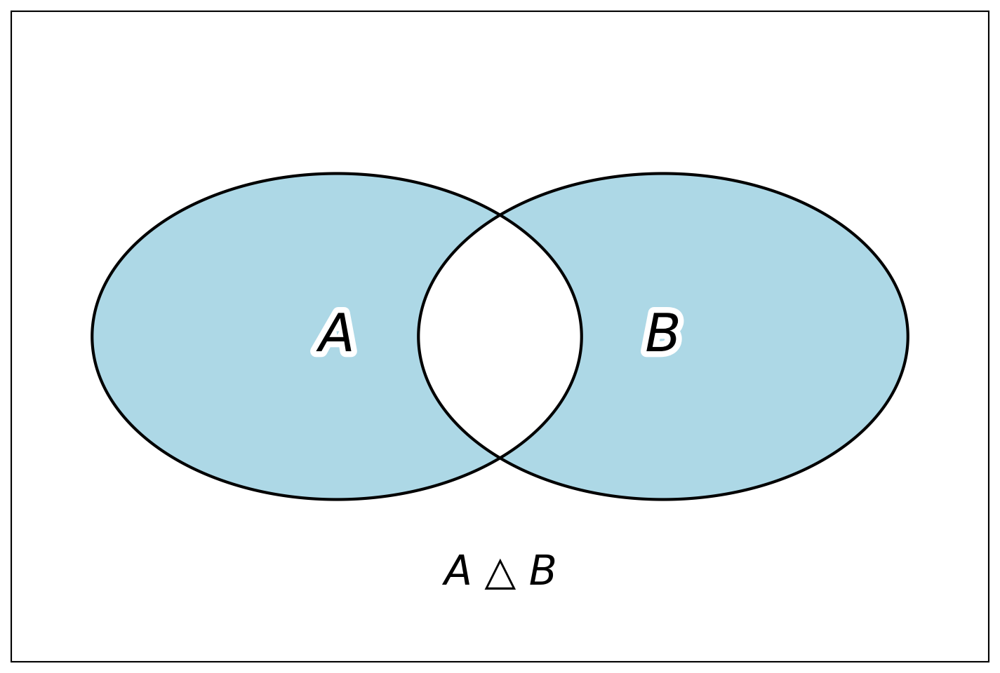

# Понятие частости и вероятности случайного события

При изучении различных дисциплин, как в средних, так и в высших учебных заведениях предполагается определённая детерминированность событий и функций, когда каждое событие является следствием другого. Примером тому служат физические законы, представляющие собой строгие математические закономерности и описывающие зависимости одних величин от других.

Однако повседневная деятельность постоянно опровергает это положение. Например, при проверке любых физических законов (на лабораторных занятиях по физике) обнаруживается, что каждое новое экспериментальное измерение одного и того же параметра даёт различные результаты. Есть также величины, которые являются ещё более неопределёнными. Невозможно, например, точно предсказать количество заболевших ОРВИ в коллективе преподавателей (или студентов) на заданный момент времени, длительность пребывания покупателя в торговом зале супермаркета и т.п.

Величины, точное значение которых заранее неизвестно для каждой реализации, называются *случайными*. При этом случайность не означает, что невозможно получить и использовать на практике какую-либо информацию о процессе. Например, при запуске нового цифрового сервиса можно отслеживать, как меняется количество регистраций пользователей или частота использования функций приложения среди первых 1000 клиентов. Эти данные помогают принять решения о масштабировании инфраструктуры, найме дополнительных специалистов или внесении изменений в пользовательский интерфейс. Несмотря на случайный характер исследуемых величин, возможно нахождение определённых закономерностей, которые и используются далее в практической деятельности специалистов. Теоретической базой для этого выступает теория вероятностей и её важнейшее понятие — *случайное явление*. *Теория вероятностей* — математическая наука, изучающая закономерности в массовых случайных явлениях независимо от их природы и дающая методы количественной оценки влияния случайных факторов на различные явления.

Большинство из окружающих нас явлений повседневной жизни являются случайными. Следует отметить, что теория вероятностей, как правило, абстрагируется от физического смысла изучаемого явления, а интересуется лишь ответом на вопрос: произошло или нет в данном эксперименте ожидаемое событие, каковы в этот раз были количественные показатели рассматриваемого случайного явления. Можно сказать, что случайное явление имеет две стороны: качественную и количественную. Качественной стороной случайного явления является случайное событие, а количественной — случайная величина.

*Событие* — это факт, который в результате опыта (эксперимента, испытания) может произойти или не произойти. Случайные события принято обозначать заглавными буквами латинского алфавита, начиная с первых — *А, В, С, …*

::: {.example #exm-1-01}

Случайное событие — качественная сторона случайного явления; здесь это просмотр пользователями сайта интернет-магазина.

Пример: «Зашел ли посетитель сайта интернет-магазина в раздел скидок во время рекламной кампании?»

Это событие носит качественный характер — мы интересуемся только фактом: произошло оно или нет. Это может быть важно при анализе поведения пользователей на сайте, чтобы понять, привлекает ли акция внимание.
:::

::: {.example #exm-1-02}

Случайная величина — количественная сторона случайного явления; здесь это время просмотра пользователем страницы оформления заказа.

Пример: «Сколько времени (в минутах) пользователь провел на странице оформления заказа в приложении перед тем, как завершить покупку?»

Здесь мы имеем дело с количественным показателем, который заранее неизвестен, но может быть измерен и проанализирован. Это полезно, например, для оптимизации интерфейса приложения: если время слишком большое, возможно, процесс оформления заказа нужно упростить.
:::

::: {.example #exm-1-03}

**Примеры событий**

**Событие A** — Пользователь успешно зарегистрировался в приложении после первой попытки ввода данных.

**Событие B** — Сервер обработал запрос клиента без ошибки в течение 5 секунд.

**Событие C** — Пользователь оставил отзыв о товаре в течение 10 минут после завершения покупки.

:::

В повседневной жизни люди иногда пытаются охарактеризовать события по степени возможности их появления в той или иной ситуации, по частоте проявления их в более или менее одинаковых условиях. При этом не математики говорят об относительной частоте появления случайных событий, рано или поздно приходя к термину «*вероятность случайного события*». Специалисты, близкие к математике, сказали бы о частости случайного события.

В большинстве отраслей науки определение фундаментальных понятий — это весьма трудная, а чаще всего просто невыполнимая задача. Поэтому приведём несколько подходов к понятию «вероятность случайного события». Это не математические определения и не элементы аксиоматического построения теории вероятностей, сформулированного А.Н. Колмогоровым в 1933 году, а описание и иллюстрация научного термина.

Вероятность случайного события может рассматриваться как мера «объективной возможности» этого события, как количественная мера «степени уверенности» познающего субъекта. Это так называемое *«философское»* определение вероятности случайного события.

Вероятность случайного события принято обозначать $P(A)$ от латинского слова «*probabilitas*» — вероятность, правдоподобие. Одним из важнейших свойств вероятности случайного события является то, что она лежит в пределах от 0 (нуля) до 1 (единицы):

$$
0 \leq P(A) \leq 1
$$ {#eq-01-probability-range}

Кстати, это упрощённая запись первой из трёх аксиом в аксиоматическом построении теории вероятностей А.Н. Колмогорова. К сожалению, данное определение не отвечает на вопрос: «Откуда берутся объективные закономерности, о которых упоминалось в определении теории вероятностей как математической науки?».

Можно попытаться установить их из практики, основываясь на результатах наблюдений. С древних времён подмечено, что частость появления многих событий демонстрирует тенденцию к стабилизации около некоторого значения при неограниченном увеличении количества испытаний. Таким образом, приходим к изложенному ниже следующему определению.

Вероятность случайного события может рассматриваться как предел частости (относительной частоты) появления события в большом количестве испытаний. Это можно назвать *«статистическим»* определением вероятности случайного события:

$$
P^{*}(A) = \frac{m}{n} \rightarrow P(A) = \lim_{n \rightarrow \infty}\frac{m}{n}
$$ {#eq-classic-prob}

Подобный подход является, пожалуй, самым распространённым в трактовке термина «вероятность случайного события», им охватывается огромное множество случайных событий. Он не требует от исследователя математической строгости, требуется лишь одно — сколь возможно большое число экспериментов. См. @eq-classic-prob.

Ближе всего аксиоматическому подходу к определению понятия вероятности случайного события отвечает формулировка, приведённая в следующем пункте.

Вероятность случайного события рассматривается как мера равновероятности событий, «равновозможности» исходов опытов. Иногда это называют *«классическим»* определением. При этом вероятность события оценивается даже до проведения испытаний, основываясь только на структуре изучаемых явлений. Множество исходов опыта разбивается на группы равновозможных исходов, тогда вероятность случайного события определяется как отношение числа равновозможных исходов опыта, благоприятствующих появлению события *А*, к общему числу равновозможных исходов:

$$
P(A) = \frac{m}{n}
$$ {#eq-01-classic-definition}

Уместно ещё раз повторить, что отдельные исходы опыта должны иметь одинаковую возможность появления и общее их количество должно быть конечно.

Из классического определения вероятности вытекают её свойства. Вероятность *достоверного события*, т.е. такого, которое происходит неизбежно в результате каждого испытания, равна единице.

Действительно, для достоверного события $U$ количество появления события $m = n$, следовательно, $P(U) = \frac{m}{n} = 1$. Вероятность *невозможного события*, т.е. такого, которое в результате каждого испытания вовсе не может произойти, равна нулю. Для невозможного события $V$ количество появления события $m = 0$, откуда $P(V) = \frac{0}{n} = 0$.

::: {.example #exm-1-04}

Событие $A$ — наиболее вероятное.

«Пользователь откроет электронное письмо с рекламной рассылкой, если в теме письма указано слово "скидка".»

В IT-бизнесе слова, привлекающие внимание, такие как "скидка", часто увеличивают вероятность открытия письма. Допустим, из 100 отправленных писем с такой темой 87 были открыты. Тогда по классическому определению вероятности:

$$
P(A) = \frac{87}{100} = 0,87
$$

Это довольно высокая вероятность, близкая к 1, что делает событие A наиболее вероятным.

:::

::: {.example #exm-1-05}

Событие $B$ — событие со средней частостью.

«Пользователь завершит покупку в интернет-магазине после добавления товара в корзину.»

Добавление товара в корзину не гарантирует покупку, так как пользователь может передумать или столкнуться с проблемами. Предположим, из 100 пользователей, добавивших товар в корзину, только 45 завершили покупку. Тогда:

$$
P^{*}(B) = \frac{45}{100} = 0,45
$$

Что указывает на среднюю частость события.

:::

::: {.example #exm-1-06}

Событие $C$ — нулевая частость в наблюдениях.

В течение дня интернет-магазин зафиксировал 100 попыток покупки. Из-за сбоя платёжного сервиса ни одна из них не завершилась успешно.

В этой выборке число успешных покупок $m=0$, а общее число попыток $n=100$. Тогда наблюдаемая частость равна:

$$
p^{*}(C) = \frac{0}{100} = 0
$$

Нулевая частость в выборке не означает, что событие невозможно в принципе: она описывает только результаты проведённых наблюдений.

Например, после восстановления сервиса в серии из 1000 попыток могла завершиться успехом одна покупка. Тогда частость стала бы равной:

$$
p^{*}(C) = \frac{1}{1000} = 0,001
$$

Поэтому оценку вероятности нельзя строить только на одной малой серии наблюдений: важны условия эксперимента, объём данных и выбранная статистическая модель.

:::

::: {.example #exm-1-07}

Событие $D$ — частость, равная единице в наблюдениях.

«Пользователь увидит сообщение об успешной загрузке страницы, если страница полностью загрузилась.»

Предположим, из 100 загрузок страницы сообщение отобразилось все 100 раз. Тогда наблюдаемая частость равна:

$$
p^{*}(D) = \frac{100}{100} = 1
$$

Однако такой результат ещё не доказывает, что событие достоверно: он говорит лишь о данной серии наблюдений.

Например, в другой серии из 1000 загрузок из-за ошибки программной логики сообщение могло не появиться один раз. Тогда частость стала бы равной:

$$
p^{*}(D) = \frac{999}{1000} = 0,999
$$

Тем самым частость, близкая к единице, не заменяет определения достоверного события и не отменяет необходимости анализировать условия эксперимента.

:::

Вероятность случайного события *А* удовлетворяет двойному неравенству: $0 \leq P(A) \leq 1$. Действительно, любому событию благоприятствует число элементарных исходов опыта *m*, удовлетворяющее неравенству $0 \leq m \leq n$. Тогда, согласно классической формуле вероятности случайного события, $0 \leq P(A) \leq 1$.

В качестве оценки вероятности появления случайного события принимают его *частость*:

$$
p^{*} = \frac{m}{n}
$$ {#eq-01-frequency-estimate}

Доказано, что оценка вероятности появления случайного события, вычисленная по приведённой выше формуле, является несмещённой.

## Методы непосредственного подсчёта вероятностей

1\) *Классический* метод подсчёта вероятности. Этот метод иногда ещё называется «Схема урн». Метод подсчёта вероятности по доле шансов, благоприятствующих данному событию, принято называть классическим. Классический метод находит применение в случаях, когда исходы опыта теоретически равновозможны, а количество их относительно невелико.

Тогда вероятность случайного события вычисляют по формуле:

$$
P(A) = \frac{m}{n}
$$ {#eq-01-classical-method}

где:
- $m$ — количество исходов эксперимента, благоприятствующих появлению события *А*;
- $n$ — количество равновозможных исходов эксперимента.

::: {.example #exm-1-08}

На сервер поступают 10 запросов от пользователей: 7 из десктопной версии сайта и 3 из мобильной. Определить вероятность того, что первый обработанный запрос окажется от мобильного пользователя.

***Решение.*** Обозначим случайное событие A — первый обработанный запрос поступил от мобильного пользователя.

Число элементарных исходов, благоприятствующих первенству обращения мобильного пользователя (событию $A$), равно $m=3$. Общее число равновозможных исходов $n=7+3=10$. Согласно @eq-01-classical-method, $P(A)=\frac{m}{n}=3/10=0{,}3$.

:::

Достоинством данного метода считается то, что он позволяет вычислить вероятность случайного события, не проводя опыта, то есть, не расходуя времени, людских и материальных ресурсов, основываясь лишь на логических рассуждениях. С другой стороны, условие равновозможности исходов опыта, выдвинутое выше, редко выполняется на практике. Кроме того, вычисление количеств *m* и *n* требует основательного знания основ комбинаторики.

2\) *Геометрический* метод подсчёта вероятности применяется в тех случаях, когда исходов у эксперимента бесконечно много, но все они равновозможны и могут быть измерены по длине, времени или объёму.

Если пространство всех возможных исходов и область, благоприятная событию, можно измерить одной и той же величиной (например, секундой времени или пикселем интерфейса), вероятность события вычисляется как отношение соответствующих величин:

$$
P(A) = \frac{m\ S_{1}}{n\ S_{\Sigma}}
$$ {#eq-01-geometric-method}

где:

$m\ S_{1}$ — длина, время, площадь или объём области, где происходит событие *A*;

$n\ S_{\Sigma}$ — длина, время, площадь или объём области всего пространства возможных исходов.

Например, в IT-среде такой метод может использоваться:

- для оценки вероятности того, что два случайных запроса от разных пользователей поступят на сервер с интервалом менее 0,1 секунды;

- для вычисления шанса того, что пользователь кликнет по определённой зоне на экране, если его касание происходит случайным образом в пределах окна приложения;

- при моделировании задержек сети — чтобы определить вероятность, что время отклика сервера попадёт в определённый временной интервал.

Подобные задачи не могут быть решены с помощью классического метода, и в таких случаях целесообразно использовать именно геометрический подход.

::: {.example #exm-1-09}

Два клиента случайным образом отправляют запрос к серверу в течение одной и той же секунды. Запросы считаются конфликтующими, если они приходят с разницей менее 0,2 секунды, поскольку в этом случае ресурсы сервера перегружаются. Какова вероятность того, что произойдёт конфликт?

***Решение.***

На первый взгляд кажется, что можно воспользоваться классическим методом, но это задача с двумя непрерывно меняющимися величинами — временем прихода первого и второго запроса. Пусть они обозначаются как $t_{1}$ и $t_{2}$, где каждый из них равномерно распределён на интервале от 0 до 1 секунды. Тогда все возможные пары ${(t}_{1},t_{2})$ образуют квадрат со стороной 1 на координатной плоскости:

$$
0 \leq t_{1} \leq 1,\ \ 0 \leq t_{2} \leq 1
$$

Благоприятным исходом будет считаться такой, при котором ${|t}_{1} - t_{2}| < 0,2$. Это — две полосы вдоль главной диагонали квадрата шириной 0,2. Геометрически они составляют следующую площадь:

$$
m\ S_{1} = 1 - (1 - 0,2)^{2} = 1 - 0{,}64 = 0{,}36
$$

Почему площадь благоприятной области $m\ S_{1}$ именно такая? Потому что исключаются два треугольника в углах, где разность превышает 0,2; их суммарная площадь составляет $(1 - 0,2)^{2}=0{,}64$.

Общая площадь всех возможных исходов: $n\ S_{\Sigma} = 1 \times 1\  = 1$.

Следовательно, по геометрическому методу:

$$
P(A) = \frac{m\ S_{1}}{n\ S_{\Sigma}} = \frac{0,36}{1} = 0,36.
$$

Таким образом, применяя геометрический метод мы оценивали вероятность на основе двумерной площади, а не простого деления длин. Такие задачи встречаются при моделировании коллизий в сетевых запросах, синхронизации потоков, анимации и других параллельных процессах в ИТ.

{#fig-request-similarity-zone}

:::

3\) *Статистический* метод — вероятность случайного события в этом случае понимается как предел частости (частоты) появления события в большом количестве испытаний. Здесь понятие «вероятность случайного события» вытекает из практики, из накопления сведений об изучаемом случайном явлении.

Если провести *n* опытов в одинаковых условиях и подсчитать *m* — число появления интересующего нас события, то частость появления события может быть вычислена по формуле:

$$
P^{*}(A) = p = \frac{m}{n}
$$ {#eq-01-statistical-method}

При увеличении числа экспериментов в серии, частость, изменяясь при изменении числа *n*, тем не менее, стабилизируется около некоторого конкретного числа. Это число при условии $n \rightarrow \infty$ и принимают за вероятность случайного события.

Теорема Бернулли утверждает, что при неограниченном увеличении числа опытов частость случайного события сходится по вероятности к его вероятности, то есть:

$P(A) = \lim_{n \rightarrow \infty}\frac{m}{n}$.

Конечно, на практике не требуется проводить бесконечное число испытаний, чтобы определить вероятность события. Однако с увеличением числа наблюдений частота появления события всё ближе приближается к его теоретической вероятности. Именно поэтому в прикладных задачах — например, при анализе поведения пользователей, тестировании ИТ-систем или изучении отказов оборудования — оценка вероятности часто строится на основе эмпирических данных, полученных в результате наблюдений. Чем больше данных собрано, тем более надёжной и устойчивой будет оценка вероятности.

## Классификация событий. Отношения между событиями.

Событие называется *достоверным* ($U$), если оно обязательно появляется в результате данного опыта. Вероятность достоверного события равна единице: $P(U) = 1$.

::: {.example #exm-1-10}

После нажатия пользователем кнопки «Отправить» в корректно работающем интерфейсе форма будет закрыта или обновлена. Событие $U$ — система отреагировала на нажатие — является достоверным, поскольку в штатных условиях оно происходит всегда.

:::

Событие называется *невозможным* ($V$), если оно не может появиться в результате данного опыта. Вероятность невозможного события равна нулю: $P(V) = 0$

::: {.example #exm-1-11}

Открытие доступа к защищённому разделу системы без учётных данных или прав. Событие $V$ — доступ предоставлен при отсутствии авторизации — невозможно при корректной работе системы.

:::

Событие называется *случайным* если в результате опыта оно может появиться, но может и не появиться, причём это заранее неизвестно. Вероятность случайного события, как уже было сказано, лежит в пределах от нуля до единицы: $0 \leq P(A) \leq 1$.

::: {.example #exm-1-12}

На главной странице веб-сервиса размещено уведомление о новой функции. Один пользователь может обратить на него внимание и перейти, другой — проигнорировать. Событие $A$ — пользователь откроет подробности функции — случайно, так как заранее нельзя сказать, произойдёт оно или нет: оно зависит от множества факторов, включая интерфейсную перегрузку и контекст использования сервиса.

:::

Противоположное событие *Ā* — происходит в данном опыте тогда и только тогда, когда событие *А* не происходит, таким образом: $P(A) + P(Ā) = 1$.

::: {.example #exm-1-13}

Для события $A$ — пользователь покинул сайт в течение первых 10 секунд после загрузки — противоположным является событие $\overline{A}$: пользователь остался на сайте дольше 10 секунд. Такое противопоставление используют при анализе пользовательского поведения для оценки привлекательности интерфейса, скорости загрузки и качества контента. Суммарная вероятность событий $A$ и $\overline{A}$ равна 1, поскольку в каждом случае обязательно происходит либо одно, либо другое.

:::

Для лучшего понимания отношений между событиями применяют особый вид геометрических иллюстраций — *диаграммы Венна*. На таких диаграммах прямоугольник обозначает всё множество возможных результатов опыта — то есть все элементарные события, которые могут произойти. Сами события, которые нас интересуют, изображаются как области произвольной формы внутри прямоугольника — чаще всего овалы или круги. Если нужно оценить вероятность, то площадь области, представляющей событие, можно считать пропорциональной вероятности этого события — при этом предполагается, что вся площадь прямоугольника равна 1.

На рисунке 1.2 случайное событие *А* представлено эллипсом, а противоположное ему событие *Ā* представляет собой остальную площадь внутри прямоугольника.

{#fig-venn-complement fig-pos="H"}

Эта диаграмма разбивает пространство возможных исходов на две непересекающиеся части. Внутри эллипса находятся исходы, при которых происходит событие $A$, а вся оставшаяся область соответствует событию $\overline{A}$. Вместе эти области исчерпывают все возможные исходы опыта.

Два события называются *эквивалентными* (равносильными), если в каждом испытании они либо происходят одновременно, либо одновременно не происходят. Как множества исходов такие события совпадают, поэтому их обозначают равенством: $A=B$.

::: {.example #exm-1-14}

Эквивалентными событиями в информационной системе могут быть: $A$ — пользователь получил доступ к защищённому разделу, и $B$ — система зарегистрировала факт успешной аутентификации пользователя. Поскольку одно из этих событий происходит тогда и только тогда, когда происходит другое, они эквивалентны: $A=B$.

:::

{#fig-venn-equivalent fig-pos="H"}

Совпадение областей означает более сильное утверждение, чем простое равенство вероятностей. У эквивалентных событий совпадают сами наборы благоприятных исходов, поэтому из $A=B$ следует $P(A)=P(B)$. Однако одинаковые вероятности сами по себе ещё не делают два события эквивалентными.

*Суммой* (объединением) случайных событий *А* и *В* называется событие *С*, состоящее в выполнении <u>или</u> события *А*, <u>или</u> события *В*, <u>или</u> обоих вместе; иначе говоря, в появлении хотя бы одного из событий *А* и *В:* $C = A + B$. Если события представить как множества *А* и *В* (рис. 1.4), то суммой событий называют объединение этих множеств: $C = A \cup B$. На рисунке 1.4 объединением множеств является закрашенная область, которая состоит из трёх частей: первая — осуществляется только событие *А* и не осуществляется *В*; вторая — осуществляется только событие *В* и не осуществляется *А*; третья — осуществляется и событие *А* и событие *В* (их пересечение).

Отсюда следует что *А* + *Ā* = *U*, а также *А* + *А* = *А.*

{#fig-venn-union fig-pos="H"}

::: {.example #exm-1-15}

При анализе поведения пользователей в электронной торговой системе событие $A$ — пользователь положил товар в корзину, а событие $B$ — пользователь добавил товар в избранное. Событие $C=A+B$ означает, что пользователь либо добавил товар в корзину, либо в избранное, либо совершил оба действия. Таким образом, сумма событий в данном контексте охватывает все случаи, когда товар получил явный интерес со стороны пользователя.

:::

На диаграмме объединения закрашена и центральная область пересечения. Это подчёркивает, что математическое «или» является включающим: событие $A \cup B$ происходит и тогда, когда выполнено только одно из событий, и тогда, когда выполнены оба. Если совместное выполнение нужно исключить, используется симметрическая разность.

*Симметрической разностью* событий $A$ и $B$ называется событие $D=A \triangle B$, состоящее в выполнении ровно одного из них: произошло $A$, но не $B$, или произошло $B$, но не $A$. Их пересечение $A \cap B$ в симметрическую разность не входит.

{#fig-venn-symmetric-difference fig-pos="H"}

::: {.example #exm-1-16}

В электронной торговой системе событие $A$ — пользователь положил товар в корзину, а событие $B$ — добавил его в избранное. Событие $D=A \triangle B$ означает, что пользователь совершил ровно одно из этих действий. Пользователь, который сделал оба, в событие $D$ не входит.

:::

Белая центральная область на рисунке имеет принципиальное значение: она показывает исходы, в которых действия произошли одновременно и потому не принадлежат симметрической разности. Именно этим $A \triangle B$ отличается от объединения $A \cup B$, где та же центральная область включена в событие.

*Произведением* (пересечением, совмещением) случайных событий *А* и *В* называется событие *Е*, состоящее в выполнении <u>и</u> события *А*, <u>и</u> события *В*; иначе говоря, в появлении обоих событий вместе (рис. 1.6). $E = A \times B$, или $E = A \cap B$.

Отсюда следует что *А* × *Ā* = *V*, а также *А* × *А* = *А.*

На рисунке 1.6 закрашена только общая часть событий $A$ и $B$ — то есть исходы, в которых произошли оба события.

{#fig-venn-intersection fig-pos="H"}

В случае пересечения, наоборот, внешние части обоих эллипсов остаются белыми. В событие $A \cap B$ входят только те исходы, которые одновременно удовлетворяют условиям $A$ и $B$; поэтому пересечение является частью каждого из исходных событий.

::: {.example #exm-1-17}

В электронной образовательной платформе регистрируются действия студентов. Событие $A$ — студент успешно сдал итоговый тест по курсу. Событие $B$ — студент сдал этот тест в срок, до установленной даты. Тогда событие $E=A \times B$ означает, что студент не только успешно сдал тест, но и сделал это в установленный срок.

:::
