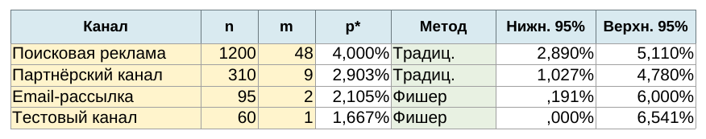
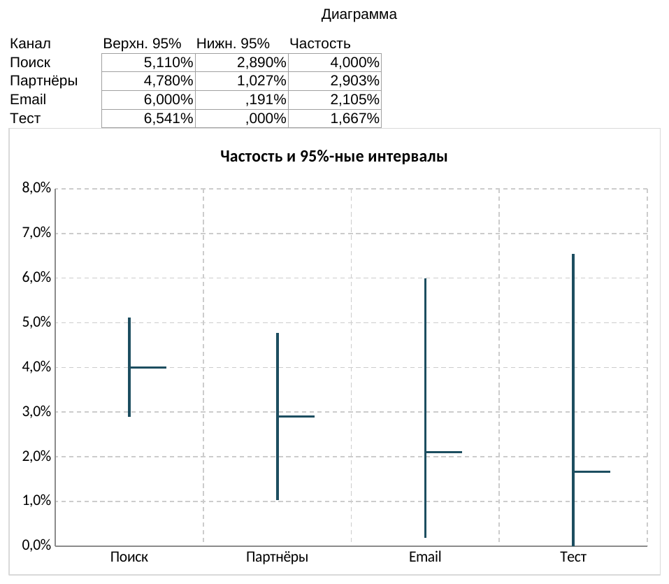

# Вычисление частостей случайных событий в LibreOffice Calc

## LibreOffice и Calc

LibreOffice — свободный офисный пакет. Его модуль Calc — табличный процессор: в ячейки вводят данные и формулы, а затем получают вычисления и диаграммы. В официальном руководстве Calc описывается именно как компонент LibreOffice для работы с таблицами, формулами и графическим представлением данных [@LibreOfficeCalcGuide].

Мы не изучаем здесь табличные процессоры с нуля: предполагается, что читатель уже умеет вводить данные и пользоваться простыми формулами. Для практики в этой книге выбран Calc, потому что это бесплатный инструмент, доступный каждому читателю, и он сохраняет рабочие книги в открытом формате ODS. Отдельные калькуляторы и специальные программы для этой задачи не нужны.

В готовой рабочей книге уже настроены формулы, рассмотренные в предыдущей главе.

```{=latex}
\repolinkblock{book/images/09_interval-estimation-calc-qr.png}{https://github.com/vshp-online/ps-it-book/blob/main/code/data/interval-estimation-calc.ods}{code/data/interval-estimation-calc.ods}
```

```{=html}
<div class="repo-material" role="group" aria-label="Материалы к примеру в LibreOffice Calc">
  <div class="repo-material-qr"></div>
  <div class="repo-material-path"><a href="https://github.com/vshp-online/ps-it-book/blob/main/code/data/interval-estimation-calc.ods"><code>code/data/interval-estimation-calc.ods</code></a></div>
</div>
```

## Пример: оценка конверсии по каналам привлечения

Интернет-магазин фиксирует визиты по четырём каналам. Событие $A$ — посетитель оформил заказ. Для каждого канала известны число визитов $n$ и число оформленных заказов $m$.

| Канал | $n$ | $m$ |
|---|---:|---:|
| Поисковая реклама | 1200 | 48 |
| Партнёрский канал | 310 | 9 |
| Email-рассылка | 95 | 2 |
| Тестовый канал | 60 | 1 |

Откройте книгу в LibreOffice Calc. Жёлтые ячейки содержат исходные данные, зелёные — выбранный способ расчёта, а остальные значения вычисляются автоматически. Промежуточные столбцы скрыты: при необходимости их можно раскрыть через **Формат → Столбцы → Показать**. Для новой задачи достаточно заменить значения в трёх первых столбцах и протянуть формулы на новые строки.

{#fig-interval-estimation-calc-preview fig-pos="H"}

В таблице для каждой строки рассчитываются частость, критерий применимости традиционного способа, границы обоих интервалов и итоговые границы. Если критерий применимости больше $5$, в итог попадают границы традиционного интервала; иначе — границы, полученные преобразованием Фишера.

::: {.example #exm-06-01}

Определить частость оформления заказа и $95\%$-ный доверительный интервал для каждого канала.

***Решение.*** Для поисковой рекламы $p^* = 48/1200 = 0{,}04$. Критерий применимости традиционного способа равен $46{,}08$, поэтому Calc выбирает традиционный интервал: приблизительно от $2{,}89\%$ до $5{,}11\%$.

Для email-рассылки $p^* = 2/95 \approx 0{,}0211$, а критерий применимости равен приблизительно $1{,}96$. Он не превышает $5$, поэтому Calc выбирает способ преобразования Фишера. Полученный интервал шире: малое число наблюдений не позволяет оценить конверсию с той же точностью.

:::

## Сравнение оценок на диаграмме

На листе «Диаграмма» находится вспомогательная таблица, связанная формулами с листом «Расчёт». Для каждого канала в ней указаны нижняя граница, верхняя граница и наблюдаемая частость. По этим данным в Calc построена биржевая диаграмма первого типа: вертикальный отрезок показывает доверительный интервал, а короткая горизонтальная отметка — значение $p^*$.

Если исходные данные изменятся, вспомогательная таблица и диаграмма обновятся вместе с результатами расчёта. Чтобы воспроизвести построение вручную, выберите таблицу на втором листе, откройте **Вставка → Диаграмма**, укажите тип **Биржевая** и первый вариант с нижней, верхней и закрывающей величинами.

::: {.example #exm-06-02}

Сравнить по диаграмме точность оценок конверсии для четырёх каналов.

***Решение.*** Для поисковой рекламы доверительный интервал имеет границы $2{,}89%$ и $5{,}11%$, поэтому его ширина составляет приблизительно $2{,}22$ процентного пункта. Для партнёрского канала ширина интервала возрастает приблизительно до $3{,}75$ процентного пункта.

У email-рассылки и тестового канала наблюдений меньше, поэтому интервалы заметно шире — приблизительно $5{,}81$ и $6{,}54$ процентного пункта соответственно. Наименее точной является оценка тестового канала: один заказ на 60 визитов даёт частость $1{,}67%$, но совместимые с наблюдениями значения занимают существенно больший диапазон.

{#fig-interval-estimation-calc-chart fig-pos="H"}

Различие наблюдаемых частостей само по себе не доказывает различия вероятностей. Здесь доверительные интервалы используются прежде всего для сравнения точности оценок; вопрос о статистической значимости требует отдельной проверки.

:::
