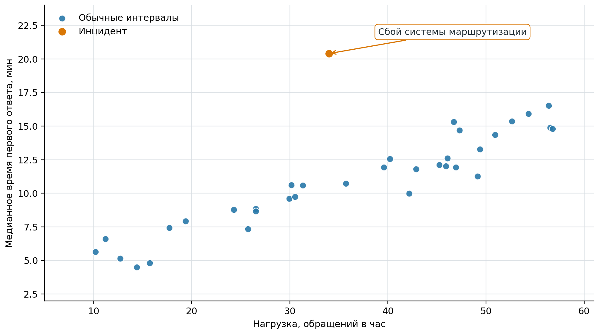
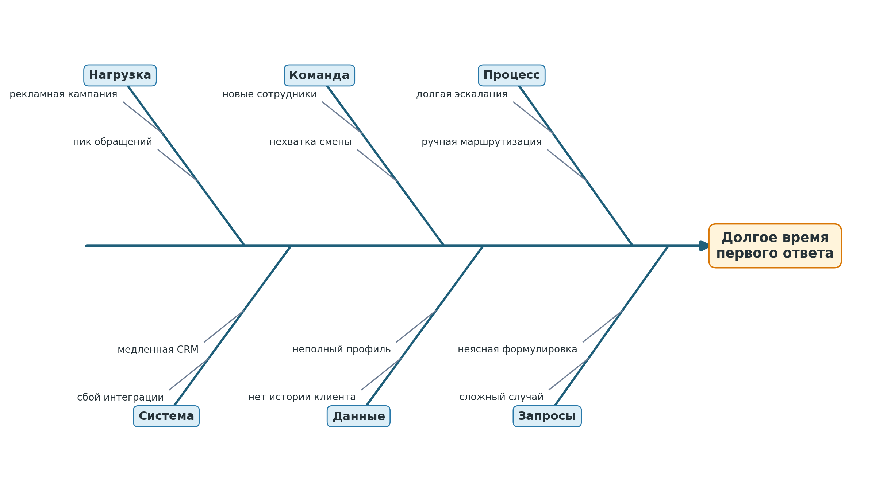

# Первичный анализ связи с помощью диаграмм

До вычисления коэффициентов и построения модели данные следует представить
графически. Диаграмма помогает увидеть форму связи, отдельные группы наблюдений,
неодинаковый разброс и значения, заметно отличающиеся от остальных. Числовая
характеристика, рассчитанная без такой проверки, может скрыть важную особенность
данных.

## Диаграмма рассеивания

*Диаграмма рассеивания* показывает совместные наблюдения двух количественных
признаков. Каждой паре $(x_i,y_i)$ соответствует точка на координатной
плоскости: значение $x_i$ откладывают по горизонтальной оси, а $y_i$ — по
вертикальной.

Для построения диаграммы необходимо:

1. убедиться, что значения $X$ и $Y$ относятся к одному объекту, клиенту,
   периоду или эксперименту;
2. указать названия показателей и единицы измерения на обеих осях;
3. выбрать масштабы, не искажающие вид данных;
4. нанести все наблюдения, включая подозрительные значения;
5. оценить направление и форму связи, наличие групп, выбросов и изменения
   разброса.

На @fig-support-load-scatterplot приведены условные данные службы поддержки.
Большей нагрузке обычно соответствует большее время ответа, однако один интервал
заметно выделяется на фоне остальных. Из журнала событий известно, что в этот
момент произошёл сбой системы маршрутизации.

{#fig-support-load-scatterplot fig-pos="H" fig-alt="Точки показывают положительную связь числа обращений в час с медианным временем ответа; отдельная оранжевая точка заметно выше остальных и подписана как сбой системы маршрутизации"}

Подозрительное наблюдение не удаляют автоматически: сначала проверяют данные и
его происхождение. Реальный инцидент анализируют отдельно и указывают его
влияние на итоговый вывод.

Диаграмма позволяет предположить наличие связи, но не оценить её величину и
статистическую значимость. Отсутствие линейного облака точек тоже не доказывает
отсутствия связи: она может быть нелинейной, различаться между группами или
маскироваться выбросами.

## Диаграмма «причина — следствие»

Когда наблюдаемая проблема может иметь много объяснений, возможные причины
удобно систематизировать с помощью диаграммы Исикавы, также называемой
диаграммой «причина — следствие» или «рыбьей костью». Каору Исикава предложил
этот инструмент для структурированного анализа проблем управления качеством
[@Ishikawa1986_GuideQualityControl].

В «голове» диаграммы записывают проблему, на крупных ветвях — группы возможных
причин, а на более мелких — конкретные проверяемые предположения.
@fig-support-ishikawa группирует такие предположения для службы поддержки.

{#fig-support-ishikawa fig-pos="H" fig-alt="Диаграмма в форме рыбьей кости группирует возможные причины долгого ответа поддержки по категориям нагрузка, команда, процесс, система, данные и запросы"}

Диаграмма Исикавы не устанавливает причинность и не показывает силу влияния.
Она помогает превратить общее обсуждение проблемы в перечень гипотез. После её
составления каждую существенную гипотезу необходимо выразить через наблюдаемые
показатели и проверить данными или экспериментом.

## Что фиксировать после графического анализа

Результатом первичного анализа должна быть не только иллюстрация, но и краткая
запись наблюдений:

- какие признаки, единицы измерения и объекты представлены;
- какой вид связи предполагается и в каких областях данных он заметен;
- имеются ли отдельные группы, пропуски или подозрительные значения;
- какие альтернативные объяснения возможны и какие статистические методы
  подходят для следующего этапа.

Для категориальных признаков отдельные точки обычно малоинформативны. Такие
данные удобнее сводить в таблицы совместных частот, которые рассматриваются в
следующем разделе.
