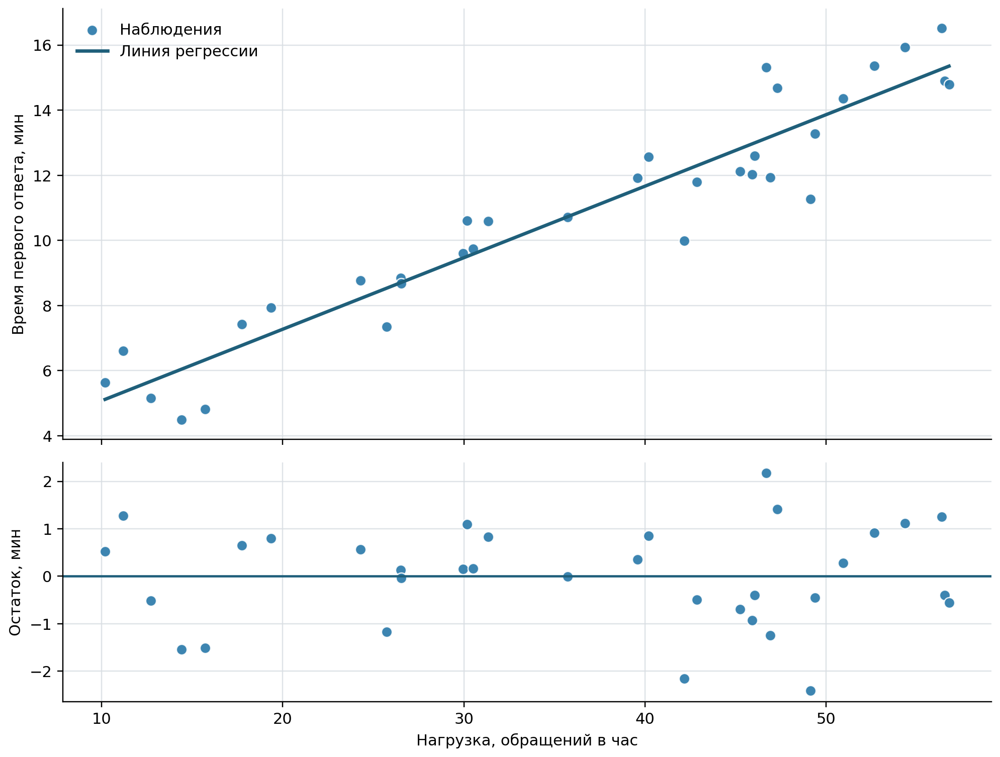

# Линейная и множественная регрессия

Корреляционный коэффициент описывает совместное изменение признаков, но не
задаёт правило расчёта ожидаемого значения одного признака по другому.
*Регрессионная модель* связывает отклик $Y$ с одним или несколькими
объясняющими признаками $X$ и позволяет оценивать средний отклик, сравнивать
вклад признаков при заданных условиях и строить прогнозы
[@Gmurman2019_ProblemsGuide; @MontgomeryRunger2018_AppliedStatistics].

Регрессионная модель сама по себе не устанавливает причинность. Названия
«объясняющий признак» и «отклик» указывают роли переменных в модели, а не
доказывают, что изменение $X$ вызывает изменение $Y$.

## Простая линейная модель

В простой линейной регрессии для каждого наблюдения предполагают

$$
Y_i
=
\beta_0+\beta_1x_i+\varepsilon_i,
\qquad i=1,\ldots,n,
$$ {#eq-simple-linear-regression-model}

где $\beta_0$ — свободный член, $\beta_1$ — коэффициент наклона, а
$\varepsilon_i$ — случайная ошибка, объединяющая неучтённые факторы и
случайную изменчивость.

После оценивания неизвестных параметров получают уравнение

$$
\widehat{y}_i=b_0+b_1x_i.
$$ {#eq-simple-linear-regression-fitted}

Коэффициент $b_1$ показывает, на сколько единиц в среднем изменяется
предсказанное значение $Y$ при увеличении $X$ на одну единицу. Его размерность
равна отношению единицы измерения отклика к единице измерения фактора.
Свободный член $b_0$ — предсказанное значение при $X=0$. Если ноль находится
далеко за пределами наблюдавшихся данных или не имеет предметного смысла,
свободный член нужен для построения модели, но не получает самостоятельной
прикладной интерпретации.

Слово «линейная» означает линейность по неизвестным коэффициентам. Например,
модель $\beta_0+\beta_1x+\beta_2x^2$ остаётся линейной по параметрам, хотя её
график является кривой.

## Метод наименьших квадратов

Для $i$-го наблюдения *остатком* называют разность между наблюдаемым и
предсказанным значениями:

$$
e_i=y_i-\widehat{y}_i.
$$ {#eq-regression-residual}

Обычный метод наименьших квадратов выбирает $b_0$ и $b_1$ так, чтобы сумма
квадратов остатков была минимальна:

$$
\operatorname{SSE}
=
\sum_{i=1}^{n}
\left(y_i-b_0-b_1x_i\right)^2
\longrightarrow
\min_{b_0,b_1}.
$$ {#eq-regression-least-squares}

Для простой линейной регрессии решение имеет вид

$$
b_1
=
\frac{
  \sum_{i=1}^{n}(x_i-\bar{x})(y_i-\bar{y})
}{
  \sum_{i=1}^{n}(x_i-\bar{x})^2
},
\qquad
b_0=\bar{y}-b_1\bar{x}.
$$ {#eq-simple-regression-coefficients}

Знак $b_1$ совпадает со знаком коэффициента корреляции Пирсона. Однако
коэффициент корреляции безразмерен, а наклон зависит от единиц измерения и
описывает изменение отклика на единицу фактора.

::: {.example #exm-support-simple-regression}
Для 34 обычных интервалов работы службы поддержки построим зависимость
медианного времени первого ответа $Y$ от нагрузки $X$ в обращениях в час.

***Решение.*** Метод наименьших квадратов даёт уравнение

$$
\widehat{y}=2{,}876+0{,}220x.
$$

При увеличении нагрузки на одно обращение в час предсказанное среднее время
ответа возрастает примерно на $0{,}220$ минуты. Свободный член описывает
продолжение линии до нулевой нагрузки и не должен трактоваться как гарантированное
время ответа при полном отсутствии обращений.

На @fig-support-regression-diagnostics сверху показаны наблюдения и линия
регрессии, а снизу — остатки. Они располагаются по обе стороны нуля без заметной
криволинейной структуры, что согласуется с выбранной линейной формой модели.

{#fig-support-regression-diagnostics fig-pos="H" fig-alt="Верхняя панель показывает точки нагрузки службы поддержки и возрастающую линию регрессии; нижняя панель показывает остатки, рассеянные вокруг горизонтальной нулевой линии"}
:::

## Качество описания данных

Общую сумму квадратов отклонений отклика от среднего можно разложить на
объяснённую и остаточную части:

$$
\underbrace{
  \sum_{i=1}^{n}(y_i-\bar{y})^2
}_{\operatorname{SST}}
=
\underbrace{
  \sum_{i=1}^{n}(\widehat{y}_i-\bar{y})^2
}_{\operatorname{SSR}}
+
\underbrace{
  \sum_{i=1}^{n}(y_i-\widehat{y}_i)^2
}_{\operatorname{SSE}}.
$$ {#eq-regression-sum-of-squares}

*Коэффициент детерминации* показывает долю выборочной изменчивости отклика,
описанную моделью:

$$
R^2
=
\frac{\operatorname{SSR}}{\operatorname{SST}}
=
1-\frac{\operatorname{SSE}}{\operatorname{SST}}.
$$ {#eq-regression-r-squared}

Для модели со свободным членом $0\leq R^2\leq1$. В простой линейной регрессии
$R^2=r^2$, где $r$ — коэффициент корреляции Пирсона. Для примера службы
поддержки $R^2=0{,}901$: в исследованном диапазоне линейная модель описывает
около 90,1% выборочной изменчивости времени ответа.

Высокое $R^2$ не доказывает правильность модели, причинность или хорошее
качество будущего прогноза. Оно может сочетаться с нелинейной структурой
остатков, выбросами, смещённой выборкой или утечкой информации. Универсальной
границы, например $R^2>0{,}5$, после которой модель автоматически становится
«пригодной», не существует.

Остаточное стандартное отклонение простой модели оценивают по формуле

$$
s
=
\sqrt{
  \frac{\operatorname{SSE}}{n-2}
}.
$$ {#eq-simple-regression-residual-standard-error}

В примере $s=1{,}080$ минуты. В отличие от $R^2$, эта величина выражена в
единицах отклика и показывает типичный масштаб отклонений наблюдений от линии
регрессии.

## Статистический вывод

Для оценки неопределённости коэффициента наклона при классических предпосылках
используют стандартную ошибку

$$
\operatorname{SE}(b_1)
=
\frac{s}{
  \sqrt{\sum_{i=1}^{n}(x_i-\bar{x})^2}
}.
$$ {#eq-simple-regression-slope-standard-error}

Гипотезу $H_0:\beta_1=0$ проверяют статистикой

$$
t
=
\frac{b_1}{\operatorname{SE}(b_1)},
\qquad
\nu=n-2.
$$ {#eq-simple-regression-slope-test}

Для данных службы поддержки $b_1=0{,}220$,
$\operatorname{SE}(b_1)=0{,}0128$, $t=17{,}11$ и $p<0{,}001$.
95%-й доверительный интервал для наклона равен
$[0{,}194;\,0{,}246]$ минуты на одно дополнительное обращение в час.
Этот вывод относится к линейной статистической связи при условиях модели и не
доказывает причинное действие нагрузки.

В простой регрессии проверка $\beta_1=0$ эквивалентна проверке нулевой
корреляции Пирсона: статистики $t$ и $p$-значения совпадают. Общую значимость
модели можно также оценивать $F$-критерием; для одного фактора выполняется
$F=t^2$.

## Средний отклик и отдельный прогноз

Для заданного $x_0$ модель даёт точечный прогноз
$\widehat{y}_0=b_0+b_1x_0$. При этом необходимо различать:

- доверительный интервал для среднего отклика всех объектов с фактором $x_0$;
- предиктивный интервал для одного нового наблюдения.

Их стандартные ошибки равны

$$
\begin{aligned}
\operatorname{SE}_{\text{ср}}(\widehat{y}_0)
&=
s\sqrt{
  \frac{1}{n}
  +\frac{(x_0-\bar{x})^2}{
    \sum_{i=1}^{n}(x_i-\bar{x})^2
  }
},\\
\operatorname{SE}_{\text{пр}}(\widehat{y}_0)
&=
s\sqrt{
  1+\frac{1}{n}
  +\frac{(x_0-\bar{x})^2}{
    \sum_{i=1}^{n}(x_i-\bar{x})^2
  }
}.
\end{aligned}
$$ {#eq-simple-regression-prediction-errors}

Предиктивный интервал шире, поскольку учитывает не только неопределённость
средней линии, но и случайное отклонение нового наблюдения от неё.

::: {.example #exm-support-regression-prediction}
Оценим время ответа при нагрузке $x_0=45$ обращений в час по модели из
@exm-support-simple-regression.

***Решение.*** Точечный прогноз равен

$$
\widehat{y}_0
=
2{,}876+0{,}220\cdot45
=
12{,}76\text{ минуты}.
$$

При уровне доверия 95% интервал для среднего времени ответа составляет
$[12{,}32;\,13{,}20]$ минуты, а предиктивный интервал для одного нового
интервала работы — $[10{,}52;\,15{,}01]$ минуты.

Прогноз сделан внутри наблюдавшегося диапазона нагрузки. Использование той же
линии далеко за его пределами было бы экстраполяцией и требовало бы
дополнительного обоснования.
:::

## Предпосылки и анализ остатков

Оценки метода наименьших квадратов и стандартные способы статистического вывода
опираются на предположения о структуре данных и ошибок
[@MontgomeryRunger2018_AppliedStatistics]:

1. средний отклик корректно описан выбранной линейной функцией;
2. наблюдения и ошибки независимы;
3. условное математическое ожидание ошибки при заданных факторах равно нулю;
4. дисперсия ошибок постоянна, если используются обычные стандартные ошибки;
5. для точных маловыборочных $t$- и $F$-выводов ошибки имеют нормальное
   распределение.

Предположения проверяют не одним формальным тестом, а совокупностью предметных
аргументов и диагностических графиков:

- остатки против предсказанных значений помогают увидеть нелинейность и
  неодинаковый разброс;
- остатки во времени позволяют заметить тренд и зависимость соседних
  наблюдений;
- квантильный график помогает оценить нормальность и крайние значения;
- меры влияния показывают наблюдения, способные заметно изменить коэффициенты.

Подозрительное наблюдение не удаляют автоматически. Сначала проверяют источник
данных, выясняют, является ли значение ошибкой или реальным особым случаем, и
сравнивают выводы с ним и без него. Например, добавление интервала со сбоем
маршрутизации в модель службы поддержки снижает $R^2$ с $0{,}901$ до $0{,}710$
и увеличивает остаточное стандартное отклонение с $1{,}080$ до $2{,}026$
минуты.

Если остатки демонстрируют структуру, возможны разные решения: уточнить
функциональную форму, добавить содержательно обоснованный фактор, преобразовать
переменную, использовать устойчивые или робастные стандартные ошибки либо
выбрать модель другого класса. Решение зависит от причины нарушения, а не от
желания увеличить $R^2$.

## Множественная линейная регрессия

Когда отклик связывают с $p$ объясняющими признаками, используют модель

$$
Y_i
=
\beta_0
+\beta_1x_{i1}
+\dots
+\beta_px_{ip}
+\varepsilon_i.
$$ {#eq-multiple-linear-regression}

Коэффициент $\beta_j$ описывает ожидаемое изменение $Y$ при увеличении
$X_j$ на единицу *при фиксированных остальных признаках модели*. Например, в
модели времени ответа можно одновременно учитывать нагрузку, число операторов
в смене и долю сложных обращений. Коэффициент нагрузки тогда сравнивает интервалы
с одинаковыми значениями остальных включённых факторов.

Такая условная интерпретация не превращает коэффициент в причинный эффект.
Неучтённые факторы, обратное влияние, ошибки измерения и способ формирования
выборки могут сохранять смещение.

Общая сумма квадратов по-прежнему разлагается на объяснённую и остаточную части.
Для проверки гипотезы о том, что все коэффициенты при факторах одновременно
равны нулю, используют статистику

$$
F
=
\frac{\operatorname{SSR}/p}{
  \operatorname{SSE}/(n-p-1)
}.
$$ {#eq-multiple-regression-f-test}

Добавление новых признаков не уменьшает обычный $R^2$, даже если они не улучшают
модель по существу. Для описательного сравнения моделей разной размерности
используют скорректированный коэффициент

$$
R_{\text{adj}}^2
=
1-(1-R^2)\frac{n-1}{n-p-1}.
$$ {#eq-adjusted-r-squared}

Однако и скорректированный $R^2$ не заменяет проверку предпосылок и качества
прогноза на данных, не участвовавших в оценивании.

Сильно связанные между собой факторы создают *мультиколлинеарность*. При ней
модель может неплохо предсказывать отклик, но отдельные коэффициенты становятся
нестабильными и получают большие стандартные ошибки. Поэтому перед
интерпретацией коэффициентов проверяют смысл факторов, их взаимные связи и
устойчивость оценок.

## Выбор и проверка модели

Пошаговое добавление или удаление факторов только по текущим $p$-значениям не
следует считать универсальным способом построения модели. Результат зависит от
порядка действий, корреляции факторов и случайных особенностей выборки, а
многократные проверки увеличивают риск случайного отбора.

Более надёжная последовательность такова:

1. заранее определить отклик, единицу наблюдения и цель — объяснение,
   статистический вывод или прогноз;
2. выбрать факторы и возможные взаимодействия по предметному смыслу;
3. разделить этапы построения и проверки модели либо применить перекрёстную
   проверку, если главная цель — прогноз;
4. оценить коэффициенты и их неопределённость;
5. исследовать остатки, влиятельные наблюдения и мультиколлинеарность;
6. сравнить качество с простой базовой моделью;
7. описать ограничения, диапазон применимости и способ получения данных.

Завершённая регрессионная модель — это не только уравнение и $R^2$, но также
проверенные предпосылки, оценка неопределённости и ясное указание, для каких
данных и решений она предназначена.

Способ проверки зависит от цели. В описательной задаче важны форма связи и
качество представления наблюдавшихся данных; при статистическом выводе —
неопределённость коэффициентов и обоснованность предпосылок; при прогнозе —
ошибка на новых данных и устойчивость результата во времени. Модель может быть
полезна для одной цели и неудовлетворительна для другой.

При практическом использовании вместе с уравнением сохраняют период и источник
данных, определения признаков, способ обработки пропусков, версию расчёта и
контрольные показатели качества. Если продукт, аудитория или процесс изменились,
распределения факторов и связь с откликом могут сдвинуться. Тогда контролируют
ошибки новых прогнозов и при необходимости заново оценивают модель.

Следующий раздел воспроизводит полный цикл корреляционного и регрессионного
анализа в LibreOffice Calc и Python: от таблицы исходных данных до диагностики
остатков и интервалов прогноза.
