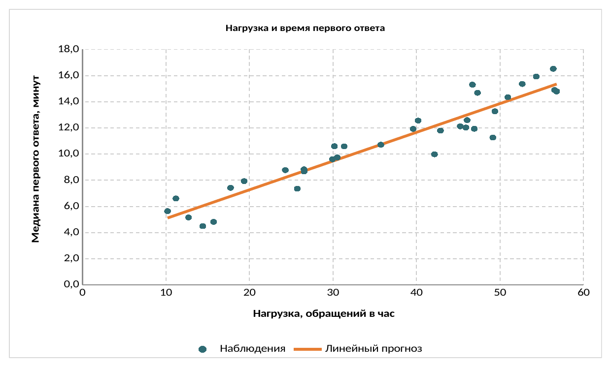

# Корреляционный и регрессионный анализ в LibreOffice Calc и Python

Воспроизведём расчёты предыдущих разделов на одном наборе данных. Единицей
наблюдения остаётся обычный интервал работы службы поддержки, фактором $X$ —
нагрузка в обращениях в час, а откликом $Y$ — медианное время первого ответа в
минутах. Отдельный интервал со сбоем маршрутизации в основной набор не включён:
это особый случай, влияние которого уже сравнивалось в разделе о предпосылках
регрессии.

Практическая цель — получить не только уравнение прямой, но и проверяемую
последовательность: исходные данные, прогнозы для наблюдений, остатки,
характеристики модели и интервальный прогноз. Диаграмма помогает оценить форму
связи, но не заменяет расчёт и предметную проверку причин возможных отклонений.

## Рабочая книга LibreOffice Calc

В рабочей книге два листа. На листе «Регрессия» жёлтым отмечены изменяемые
исходные ячейки и параметры, зелёным — результаты формул. Лист «Диаграмма»
содержит нативную XY-диаграмму Calc, связанную с теми же данными. При замене
наблюдений прогнозы, остатки, показатели модели и график пересчитываются
автоматически [@LibreOfficeCalcGuide].

```{=latex}
\repolinkblock{book/images/24_support-regression-calc-qr.png}{https://github.com/vshp-online/ps-it-book/blob/main/code/data/support-regression-calc.ods}{code/data/support-regression-calc.ods}
```

```{=html}
<div class="repo-material" role="group" aria-label="Рабочая книга корреляционного и регрессионного анализа в LibreOffice Calc">
  <div class="repo-material-qr"></div>
  <div class="repo-material-path"><a href="https://github.com/vshp-online/ps-it-book/blob/main/code/data/support-regression-calc.ods"><code>code/data/support-regression-calc.ods</code></a></div>
</div>
```

Исходные наблюдения находятся в столбцах `B` и `C`. Для каждого из них в
столбце `D` вычисляется прогноз $\widehat y_i=b_0+b_1x_i$, а в столбце `E` —
остаток $e_i=y_i-\widehat y_i$. Коэффициенты модели можно получить функциями
`SLOPE` и `INTERCEPT`; коэффициент корреляции и $R^2$ — функциями `CORREL` и
`RSQ`. В русскоязычном интерфейсе имена функций могут отображаться в
локализованном виде.

Рабочая книга даёт следующие контрольные результаты:

| Показатель | Значение |
|---|---:|
| Число наблюдений $n$ | 34 |
| Корреляция Пирсона $r$ | 0,9495 |
| Свободный член $b_0$ | 2,8760 |
| Наклон $b_1$ | 0,2197 |
| Коэффициент детерминации $R^2$ | 0,9015 |
| Остаточное стандартное отклонение $s$ | 1,0798 мин |
| $t$-статистика для наклона | 17,11 |
| 95%-й интервал для $b_1$ | [0,1936; 0,2459] |

Полученное уравнение

$$
\widehat y=2{,}8760+0{,}2197x
$$

совпадает с результатом предыдущего раздела с точностью округления. На
@fig-support-regression-calc-chart точки показывают наблюдения, а оранжевая
линия построена по вычисленным в таблице прогнозам. Это позволяет проверить,
что диаграмма и численные результаты используют одну модель.

{#fig-support-regression-calc-chart fig-pos="H" width="82%" fig-alt="Точки медианного времени первого ответа возрастают вместе с нагрузкой службы поддержки; поверх них проведена возрастающая оранжевая линия линейного прогноза"}

## Проверка наклона и прогноз

Стандартная ошибка наклона вычисляется из остаточного стандартного отклонения и
суммы квадратов отклонений нагрузки. Для выбранного уровня значимости
$\alpha=0{,}05$ выполняется $|t|>t_{\text{кр}}$, поэтому гипотеза о нулевом
наклоне отвергается. В книге решение выводится формулой, а не цветовой
индикацией: так его можно проверить независимо от оформления.

При нагрузке $x_0=45$ обращений в час получаем точечный прогноз $12{,}7631$
минуты. 95%-й доверительный интервал для среднего отклика равен
$[12{,}3214;\,13{,}2049]$ минуты, а предиктивный интервал для одного нового
наблюдения — $[10{,}5197;\,15{,}0066]$ минуты. Второй интервал шире, поскольку
учитывает отклонение отдельного наблюдения от средней линии.

Изменять $x_0$ разумно только в пределах, близких к наблюдавшемуся диапазону
нагрузки. Автоматический пересчёт таблицы не делает далёкую экстраполяцию
обоснованной.

## Тот же расчёт в Python

Python использует тот же файл `code/data/support-regression.csv`. В примере
оставлены явные вычисления коэффициентов, остатков и стандартных ошибок, чтобы
можно было сопоставить каждую величину с формулами на листе Calc. Помимо NumPy
нужна только функция распределения Стьюдента из SciPy.



При неизменных данных обе реализации дают одинаковые коэффициенты и интервалы с
точностью округления. Такое совпадение проверяет реализацию, но не предпосылки
модели: линейность, независимость наблюдений, устойчивость дисперсии и природу
особых случаев по-прежнему оценивают отдельно.

В качестве проверки чувствительности можно добавить интервал со сбоем
маршрутизации $(34;\,20{,}4)$. После пересчёта $R^2$ снижается примерно до
$0{,}710$, а остаточное стандартное отклонение возрастает примерно до $2{,}026$
минуты. Этот результат не означает, что наблюдение следует удалить; сначала
нужно установить, относится ли оно к тому же процессу, который должна описывать
модель.
