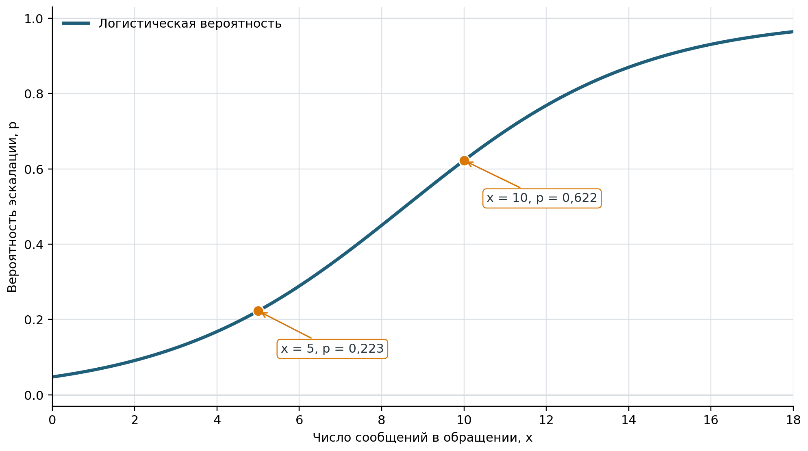

# Нелинейные модели и логистическая регрессия

Линейная регрессия удобна для описания приблизительно постоянного изменения
среднего отклика при изменении фактора. Однако в реальных процессах отклик может
ускоряться, замедляться, насыщаться или иметь естественные границы. Например,
время ответа службы поддержки способно расти особенно быстро при приближении
нагрузки к пропускной способности команды, а вероятность ухода клиента всегда
остаётся между нулём и единицей.

Выбор более сложной модели должен опираться на предметный смысл, график данных и
проверку результата, а не только на возможность получить более высокий
показатель качества [@MikhalevaOrlova2018_QuantMethods;
@MontgomeryRunger2018_AppliedStatistics].

## Что означает нелинейность модели

Линейность регрессионной модели определяется по неизвестным параметрам, а не по
форме графика. Поэтому полиномиальная модель

$$
\operatorname{E}(Y\mid X=x)
=
\beta_0+\beta_1x+\beta_2x^2
$$ {#eq-polynomial-regression}

линейна по параметрам $\beta_0$, $\beta_1$ и $\beta_2$. Её можно оценить обычным
методом наименьших квадратов, рассматривая $x$ и $x^2$ как два объясняющих
признака. Параболой является только график полинома второй степени; полиномы
других степеней имеют иную форму.

Модель называют *нелинейной по параметрам*, если хотя бы один неизвестный
параметр входит в функцию нелинейно. Например, насыщение спроса можно описывать
функцией

$$
\operatorname{E}(Y\mid X=x)
=
\beta_0+\frac{\beta_1x}{\beta_2+x}.
$$ {#eq-saturation-regression}

Здесь параметр $\beta_2$ находится в знаменателе, поэтому модель нельзя
представить как обычную линейную комбинацию заранее вычисленных признаков.
Параметры такой модели оценивают численными методами нелинейной оптимизации,
например нелинейным методом наименьших квадратов.

Некоторые зависимости допускают линеаризацию. Так, степенную зависимость
$y=ax^b$ можно записать как $\ln y=\ln a+b\ln x$. Но преобразование отклика
изменяет смысл ошибки и критерий подгонки: минимизация квадратов отклонений
$\ln y$ не равна минимизации квадратов отклонений $y$. Поэтому линеаризация
нуждается в предметном и статистическом обосновании, а не применяется
автоматически.

## Выбор функциональной формы

Кривую не следует выбирать только потому, что она проходит ближе к наблюдаемым
точкам. Полином высокой степени способен почти идеально описать учебную выборку,
но резко колебаться между точками и давать бессмысленные значения за её
пределами. Это проявление *переобучения*: модель запоминает случайные особенности
наблюдений вместо устойчивой связи.

Практическая последовательность выбора формы модели включает:

1. определить отклик, факторы, единицу наблюдения и допустимый диапазон значений;
2. предположить форму связи по устройству процесса и диаграмме рассеивания;
3. оценить несколько содержательно оправданных моделей;
4. исследовать остатки и чувствительность к отдельным наблюдениям;
5. сравнить ошибку на данных, не участвовавших в оценивании;
6. проверить, не нарушает ли прогноз естественные ограничения отклика;
7. избегать далёкой экстраполяции независимо от вида кривой.

Сложная модель оправданна, когда она устойчиво улучшает решение задачи и её
поведение можно объяснить. Одного увеличения $R^2$ для такого вывода
недостаточно.

## Бинарный отклик

Если результат наблюдения имеет два состояния, его удобно кодировать
$Y\in\{0,1\}$. В IT-бизнесе единицей может быть обращение клиента, а откликом —
факт эскалации, продления подписки, оплаты заказа или обнаружения мошеннической
операции.

Для заданного набора признаков $\boldsymbol{x}_i$ модель оценивает условную
вероятность события
$p_i=P(Y_i=1\mid\boldsymbol{X}_i=\boldsymbol{x}_i)$. Обычная линейная регрессия
не обеспечивает ограничение $0\leq p_i\leq1$ и предполагает неподходящую для
бинарного отклика структуру ошибок. Логистическая регрессия связывает с линейным
предиктором не саму вероятность, а логарифм шансов:

$$
\ln\frac{p_i}{1-p_i}
=
\eta_i
=
\beta_0+\beta_1x_{i1}+\dots+\beta_kx_{ik}.
$$ {#eq-logistic-regression-logit}

Обратное преобразование даёт вероятность

$$
p_i
=
\frac{1}{1+\exp(-\eta_i)}.
$$ {#eq-logistic-regression-probability}

Логистическая функция переводит любое значение линейного предиктора в интервал
от 0 до 1. На @fig-logistic-regression-curve показана модель, в которой
$\eta=-3+0{,}35x$. Предикторы при этом не обязаны быть бинарными: ими могут быть
количественные, категориальные и преобразованные признаки. Бинарным является
отклик.

{#fig-logistic-regression-curve fig-pos="H" fig-alt="S-образная логистическая кривая возрастает от вероятности, близкой к нулю, до вероятности, близкой к единице; отмечены значения для пяти и десяти сообщений"}

## Интерпретация коэффициентов

Коэффициент $\beta_j$ показывает изменение логарифма шансов при увеличении
$X_j$ на единицу и фиксированных остальных признаках. После возведения в степень
$\exp(\beta_j)$ получают *отношение шансов*. Значение больше 1 соответствует
росту шансов события, меньше 1 — их снижению, а значение 1 — отсутствию изменения
шансов при прочих равных условиях [@PampelGruzdevTsvirkun2023_LogisticRegression;
@Cox1958_BinaryRegression].

Отношение шансов не следует называть относительным изменением вероятности.
Одинаковое изменение шансов даёт разное изменение вероятности вблизи 0,5 и у
границ интервала.

::: {.example #exm-support-logistic-regression}
По историческим данным службы поддержки оценена модель вероятности эскалации
обращения в зависимости от числа сообщений $x$, которыми клиент и оператор
обменялись до текущего момента:

$$
\ln\frac{p}{1-p}=-3+0{,}35x.
$$

Оценим вероятность эскалации после пяти и десяти сообщений и истолкуем
коэффициент при $x$.

***Решение.*** После пяти сообщений линейный предиктор равен
$-3+0{,}35\cdot5=-1{,}25$, поэтому

$$
p_5=\frac{1}{1+\exp(1{,}25)}\approx0{,}223.
$$

После десяти сообщений получаем

$$
p_{10}
=
\frac{1}{1+\exp(-0{,}5)}
\approx0{,}622.
$$

При каждом дополнительном сообщении оценённые шансы эскалации умножаются на
$\exp(0{,}35)\approx1{,}419$, то есть возрастают примерно на 41,9% при прочих
равных условиях. Вероятность при этом не увеличивается на постоянные 41,9%.

Модель описывает статистическую связь, а не доказывает, что дополнительные
сообщения сами вызывают эскалацию. Возможны общие причины — например, сложность
проблемы или неполнота исходного обращения.
:::

## Оценивание и проверка логистической модели

Коэффициенты логистической регрессии обычно оценивают методом максимального
правдоподобия. Для независимых бинарных наблюдений функция правдоподобия имеет
вид

$$
L(\boldsymbol{\beta})
=
\prod_{i=1}^{n}
p_i^{y_i}(1-p_i)^{1-y_i},
$$ {#eq-logistic-regression-likelihood}

где вероятности $p_i$ задаёт @eq-logistic-regression-probability. Выбирают
такие коэффициенты, при которых наблюдавшаяся последовательность нулей и единиц
имеет наибольшее правдоподобие. Это не обычный метод наименьших квадратов для
преобразованного столбца из нулей и единиц.

Проверка модели зависит от цели:

- для истолкования коэффициентов оценивают их стандартные ошибки, интервалы и
  устойчивость к составу признаков;
- для вероятностного прогноза проверяют *калибровку* — соответствуют ли
  предсказанные вероятности наблюдаемым долям событий;
- для ранжирования оценивают, насколько модель отделяет наблюдения с событием от
  наблюдений без события;
- для автоматического решения отдельно выбирают порог вероятности с учётом цены
  ложноположительной и ложноотрицательной ошибки.

Порог 0,5 не является обязательным свойством логистической регрессии. При редком
событии или неравной цене ошибок другой порог может быть полезнее. Обычный
$R^2$ линейной регрессии к бинарной модели напрямую не переносится, а
псевдокоэффициенты $R^2$ имеют другое определение и требуют явного указания
использованного варианта.

## Агрегированные данные и экологическая ошибка

Термин *экологическая регрессия* в статистике относится не к экологии как
предметной области, а к анализу агрегированных показателей групп. Такой анализ
может быть корректен для группового уровня, однако связь между средними или
долями групп нельзя автоматически переносить на отдельных клиентов
[@Robinson1950_EcologicalCorrelations].

Например, если в регионах с большей долей премиальных подписок одновременно
выше средний отток, из этого не следует, что отдельные премиальные клиенты чаще
уходят. Региональные различия могут объясняться ценами, каналами привлечения,
возрастом продукта или неодинаковым составом клиентов. Вывод об индивидуальном
поведении по агрегированным данным называется *экологической ошибкой*.

Поэтому экологическая регрессия не рассматривается здесь как ещё одна
универсальная форма кривой. Сначала необходимо определить уровень наблюдения и
формулировать выводы только для того уровня, на котором собраны данные. Если
нужны выводы о клиентах, предпочтительны индивидуальные данные или специально
обоснованная многоуровневая модель.

## Как выбрать класс модели

Линейная, полиномиальная и логистическая модели решают разные задачи:

- линейная регрессия описывает количественный отклик приблизительно постоянным
  наклоном;
- полиномиальная модель допускает изгиб среднего отклика, оставаясь линейной по
  коэффициентам;
- нелинейная по параметрам модель используется, когда форма процесса задаётся
  содержательной нелинейной функцией;
- логистическая регрессия оценивает вероятность бинарного события.

Перед применением любой из них фиксируют цель анализа, уровень наблюдения,
область допустимых прогнозов и способ проверки на новых данных. Более сложная
формула не компенсирует ошибочно выбранный отклик, смещённую выборку или
необоснованную причинную интерпретацию.
