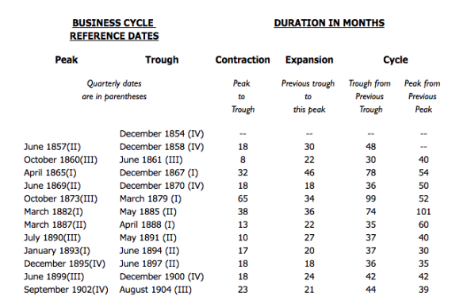

# Временные ряды как бизнес-данные

Временные ряды становятся всё более востребованным видом данных. Этому
способствуют распространение интернета вещей, электронного документооборота,
систем мониторинга и технологий умного города. Чем больше процессов
наблюдается непрерывно, тем чаще предпринимателю приходится работать не с
разрозненными значениями, а с последовательностью измерений, в которой важен
порядок появления каждого значения.

*Анализ временных рядов* извлекает описательную и статистическую информацию из
данных, расположенных в хронологическом порядке. Он помогает изучить прошлое
состояние процесса, обнаружить устойчивые изменения и построить прогноз. При
этом временная последовательность сама по себе ещё не доказывает причинную
связь: вопрос о том, почему произошло изменение, требует дополнительных данных
и отдельного исследования.

Многие показатели бизнеса наблюдаются не один раз, а последовательно во
времени: число заказов по дням, выручка по месяцам, остаток денежных средств на
конец недели, время ответа службы поддержки по часам. Упорядоченную по времени
последовательность значений одного показателя называют *временным рядом*, или
*рядом динамики*. Отдельное значение показателя называют *уровнем ряда*, а
момент или период, к которому оно относится, — *временной меткой*
[@PodkorytovaSokolov2026_TimeSeries; @MikhalevaOrlova2018_QuantMethods].

Порядок наблюдений является частью данных. Если переставить значения обычной
выборки, её среднее и стандартное отклонение не изменятся. Для временного ряда
такая перестановка разрушит сведения о последовательности роста, сезонных
колебаниях и реакции показателя на предшествующие события. Поэтому методы для
независимых наблюдений нельзя механически применять к значениям ряда без
проверки временной зависимости.

## Временные ряды в экономике

Экономические и финансовые показатели давно представляют в виде временных
рядов. Прогнозирование по известным значениям помогает планировать производство,
запасы, денежные потоки и потребность в ресурсах. Однако прогноз выражает
состояние модели и доступных данных, а не гарантирует предотвращение кризиса или
получение прибыли.

Интерес к систематическому экономическому прогнозированию усилился после
финансовых кризисов конца XIX и начала XX века. Экономисты исходили из идеи о
циклическом характере деловой активности и поначалу заимствовали часть языка у
метеорологических прогнозов. Ранние расчёты не отличались высокой точностью, но
они способствовали появлению исследовательских организаций, постоянно
собирающих и публикующих экономические показатели.

Так, Национальное бюро экономических исследований США ведёт хронологию пиков и
нижних точек делового цикла. На @fig-nber-business-cycles показан фрагмент
исторической таблицы, в которой для последовательных циклов сопоставляются даты
поворотных точек и продолжительность сжатия и расширения экономики
[@NBERBusinessCycles; @MooreZarnowitz1984_BusinessCycles].

{#fig-nber-business-cycles fig-pos="H" fig-alt="Таблица Национального бюро экономических исследований США с датами пиков и нижних точек деловых циклов и их продолжительностью в месяцах"}

Открытая публикация исторических данных дала исследователям и компаниям общий
материал для анализа. К постоянно наблюдаемым величинам относятся валовой
внутренний продукт, занятость, налоговые поступления, цены, объёмы производства
и обращения за пособием по безработице. Такие ряды применяются при разработке
экономических теорий, подготовке государственных решений и планировании
деятельности компаний.

По мере автоматизации бирж и распространения электронных торговых систем
исторические записи стали использовать не только для обзоров, но и для
формализованных правил принятия решений. Расчёты, которые прежде выполнялись
вручную, теперь воспроизводятся программно и могут регулярно обновляться при
поступлении новых наблюдений. Вместе с тем автоматизация не отменяет проверки
качества данных, предположений модели и риска изменения самого процесса.

Один и тот же ряд может поддерживать разные решения. Краткосрочного участника
рынка могут интересовать изменения между соседними торговыми днями, а
долгосрочного инвестора — направление движения на протяжении нескольких лет.
Поэтому временной масштаб выбирают по задаче: слишком короткий интервал может
подчеркнуть шум, а слишком длинный — скрыть важные локальные изменения.

## Моментные и интервальные ряды

В *моментном ряду* каждый уровень относится к определённому моменту времени.
Так измеряют остаток товара на конец дня, число активных подписок на начало
месяца или численность команды на конкретную дату. Такие уровни описывают
состояние, поэтому их обычно нельзя складывать: сумма ежедневных остатков не
равна запасу за неделю.

В *интервальном ряду* каждый уровень относится к промежутку времени. Так
фиксируют число заказов за день, выручку за месяц или продолжительность простоев
за неделю. Значения за непересекающиеся интервалы можно складывать, если
показатель определён одинаково и единицы измерения не меняются.

| Месяц | Активные подписки на конец месяца | Новые платные подписки за месяц |
|:--|--:|--:|
| Январь | 1240 | 210 |
| Февраль | 1315 | 230 |
| Март | 1280 | 205 |
| Апрель | 1390 | 260 |

: Моментный и интервальный показатели для одного цифрового сервиса {#tbl-time-series-stock-flow}

В @tbl-time-series-stock-flow число активных подписок — моментный показатель.
Складывать четыре его уровня бессмысленно. Число новых платных подписок —
интервальный показатель: за четыре непересекающихся месяца сервис получил
$210+230+205+260=905$ новых платных подписок.

Иногда один и тот же показатель можно представить с разной периодичностью.
Дневные продажи допустимо суммировать по неделям или месяцам. При укрупнении
моментного ряда вместо суммы выбирают содержательно подходящий уровень,
например остаток на последний день месяца, либо рассчитывают средний уровень с
учётом продолжительности интервалов.

## Регулярность и частота наблюдений

В *регулярном временном ряду* соседние наблюдения разделены одинаковыми
интервалами: одним часом, днём, месяцем или кварталом. В *нерегулярном ряду*
временные промежутки различаются, например обращения пользователей возникают в
произвольные моменты. Перед анализом нерегулярные события нередко агрегируют по
фиксированным интервалам, но частоту выбирают по смыслу задачи.

Слишком крупный интервал скрывает краткосрочные изменения, а слишком мелкий
может сделать ряд шумным и разреженным. Например, месячная выручка не показывает
разницу между буднями и выходными, тогда как поминутные продажи небольшого
магазина будут содержать много нулей. Периодичность следует выбирать до
построения модели и не менять внутри сравниваемого участка ряда без явного
обоснования.

## Абсолютные, относительные и средние уровни

Уровни ряда могут быть:

- *абсолютными* — 840 заказов за неделю, 120 активных клиентов;
- *относительными* — конверсия 4,2 %, доля возвратов 1,6 %;
- *средними* — средний чек 1850 рублей, среднее время ответа 7,4 минуты.

Изменение знаменателя способно заметно повлиять на относительный показатель.
Например, рост числа обращений при одновременном росте числа клиентов может не
изменить число обращений на одного клиента. Поэтому вместе с долей или средним
значением полезно хранить исходные числитель, знаменатель и число наблюдений.

Для сравнения формы нескольких рядов их иногда приводят к общей базе. Если
$y_b$ — уровень выбранного базисного периода, то базисный индекс уровня $y_t$
равен

$$
I_t = \frac{y_t}{y_b}\times100\%.
$$ {#eq-time-series-base-index}

Базисный индекс показывает уровень относительно базы, принятой за 100 %, но не
заменяет исходные значения и не устраняет различия в единицах измерения.

::: {.example #exm-time-series-base-index}
Для моментного ряда из @tbl-time-series-stock-flow примем январь за базу. Тогда
для апреля по @eq-time-series-base-index получаем

$$
I_{\text{апр}}=\frac{1390}{1240}\times100\%\approx112{,}1\%.
$$

***Решение.*** На конец апреля число активных подписок составляло примерно
112,1 % январского уровня, то есть было выше него примерно на 12,1 %. Такой
вывод относится к двум моментам времени и сам по себе не объясняет причины
роста.
:::

## Подготовка ряда к анализу

До расчёта показателей и построения прогноза следует проверить:

1. одинаково ли определён показатель на всём рассматриваемом интервале;
2. сохранены ли единицы измерения, временная зона и границы периодов;
3. отмечены ли пропуски отдельно от настоящих нулевых значений;
4. отсутствуют ли дубликаты временных меток и пересекающиеся интервалы;
5. зафиксированы ли изменения продукта, учётной системы и бизнес-процесса,
   способные вызвать структурный сдвиг.

Исправление ошибки в системе учёта, смена тарифов или запуск нового канала
продаж могут изменить ряд сильнее обычных случайных колебаний. Такие события не
следует автоматически удалять как выбросы: их отмечают и учитывают при
интерпретации, разделении ряда на сопоставимые участки и оценке прогноза.
