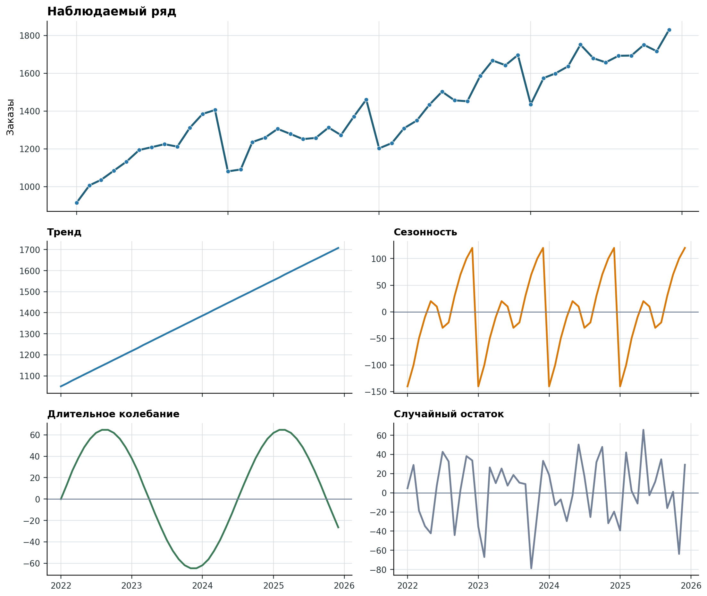

# Компоненты временного ряда

График временного ряда — первый инструмент анализа. По горизонтальной оси
откладывают время, по вертикальной — уровни показателя, а соседние наблюдения
соединяют в хронологическом порядке. Такой график помогает увидеть направление
изменения, повторяющиеся колебания, резкие сдвиги и необычные наблюдения, которые
могут потеряться в таблице [@PodkorytovaSokolov2026_TimeSeries;
@MikhalevaOrlova2018_QuantMethods].

Ни один из этих признаков не следует трактовать механически. Возрастающая линия
не объясняет причину роста, повторение нескольких пиков ещё не доказывает
устойчивую сезонность, а отдельный скачок может отражать как реальное событие,
так и изменение системы учёта.

## Учебный ряд заказов

Рассмотрим синтетический ряд из 48 месячных наблюдений интернет-магазина с
января 2022 года по декабрь 2025 года. Данные созданы программно, поэтому для
них известны составляющие, из которых получен наблюдаемый ряд. В реальной задаче
компоненты по отдельности не наблюдаются: аналитик оценивает их по исходным
уровням и дополнительным сведениям о бизнесе.

{#fig-time-series-components fig-pos="H" fig-alt="Верхний график показывает возрастающий месячный ряд заказов с повторяющимися пиками; ниже отдельно показаны линейно возрастающий тренд, повторяющаяся внутри года сезонность, плавное длительное колебание и нерегулярный случайный остаток"}

Исходные значения сохранены в
`code/data/monthly-orders-time-series.csv`. Столбец `orders` содержит уровни,
которые будут доступны аналитику, а остальные столбцы раскрывают устройство
синтетического примера и понадобятся для проверки последующих методов.

## Тренд

*Тренд* — долговременное направление изменения уровня ряда. Он может быть
возрастающим, убывающим или примерно постоянным; линейная форма является лишь
одним из возможных вариантов. В @fig-time-series-components тренд отражает
постепенное увеличение базового числа заказов.

Тренд не обязан сохраняться за пределами наблюдаемого периода. Рост продукта
может замедлиться из-за насыщения рынка, изменение цены — изменить наклон, а
перестройка учёта — создать видимый скачок без соответствующего изменения
реального процесса. Поэтому продолжение линии тренда в будущее является
модельным предположением, а не автоматическим следствием графика.

## Сезонность

*Сезонностью* называют колебания, повторяющиеся с известным календарным или
операционным периодом. Для месячных данных период часто равен 12, для дневных —
7 при недельном ритме, для почасовых — 24 при суточном. В учебном ряду уровни
обычно ниже в начале года и выше в ноябре и декабре.

Сезонность следует отличать от простого чередования значений. Повторяемость
должна иметь содержательное объяснение и наблюдаться более чем в одном полном
цикле. Праздники с меняющимися датами, различная длина месяцев и неодинаковое
число рабочих дней требуют отдельных календарных признаков или предварительной
корректировки данных.

## Циклические колебания

*Циклическими* называют сравнительно длительные подъёмы и спады, период и
амплитуда которых не обязаны быть постоянными. Они могут быть связаны с
инвестиционными циклами, изменениями спроса, обновлением продукта или общей
экономической конъюнктурой. В отличие от сезонности, такой цикл обычно не
привязан к фиксированному месяцу или дню недели.

На коротком ряду циклическую составляющую трудно отличить от нелинейного тренда
или структурного сдвига. Поэтому несколько плавных поворотов графика ещё не
дают основания объявлять найденный период устойчивым и экстраполировать его в
будущее.

## Случайная и необъяснённая составляющая

После учёта систематических компонентов остаётся *случайная*, или
*необъяснённая*, составляющая. В неё входят обычная вариативность спроса,
неучтённые воздействия, ошибки измерения и отдельные события. Остаток модели не
следует автоматически считать чистым случайным шумом: заметная структура в
остатках означает, что модель пропустила часть закономерности.

Особые события полезно хранить отдельными признаками. Сбой платёжной системы,
массовая рассылка или изменение тарифа могут создать отклонение, которое нельзя
ни безусловно удалить, ни без пояснения использовать как обычное наблюдение.

## Аддитивное и мультипликативное представление

Если амплитуда колебаний примерно постоянна в единицах показателя, ряд удобно
представлять аддитивно:

$$
y_t=T_t+S_t+C_t+\varepsilon_t,
$$ {#eq-time-series-additive-components}

где $T_t$ — тренд, $S_t$ — сезонность, $C_t$ — циклическая составляющая, а
$\varepsilon_t$ — остаток. Именно так построен ряд на
@fig-time-series-components.

Если размах колебаний растёт вместе с уровнем ряда, может быть уместно
мультипликативное представление:

$$
y_t=T_t\cdot S_t\cdot C_t\cdot E_t.
$$ {#eq-time-series-multiplicative-components}

В нём относительные компоненты $S_t$, $C_t$ и $E_t$ колеблются вокруг 1. После
логарифмирования произведение превращается в сумму, однако логарифм требует
положительных уровней. Выбор представления проверяют по данным, а не назначают
только по названию показателя.

## Что проверить перед сглаживанием

Перед выделением тренда или построением прогноза следует:

1. построить исходный график без предварительного сглаживания;
2. отметить пропуски, выбросы и известные изменения процесса;
3. проверить периодичность наблюдений и наличие полных сезонных циклов;
4. сравнить амплитуду колебаний при низком и высоком уровне ряда;
5. определить, какой горизонт прогноза нужен для решения задачи.

Сглаживание уменьшает краткосрочные колебания и помогает увидеть общую форму,
но одновременно скрывает детали. Поэтому сглаженный ряд всегда рассматривают
вместе с исходным, а параметры метода выбирают с учётом частоты данных и цели
анализа.
