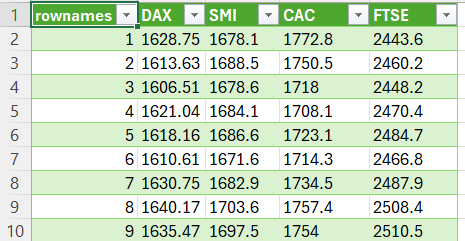
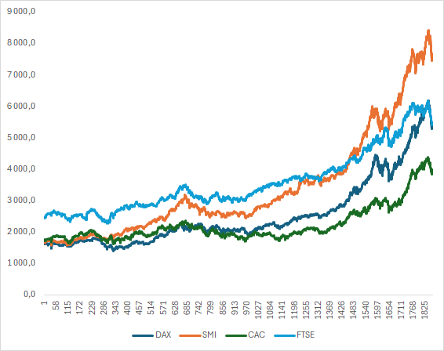
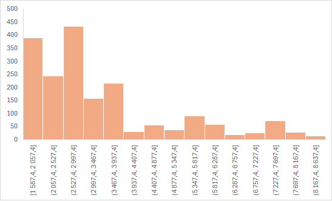
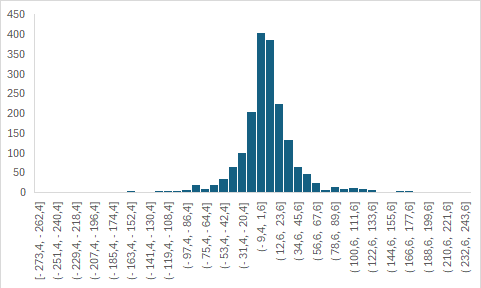

# Визуальный анализ временного ряда

Первое знакомство с временным рядом начинают с тех же общих вопросов, что и
исследование обычной таблицы данных:

- какие столбцы и единицы измерения содержит набор;
- каковы диапазон, среднее значение и разброс каждого показателя;
- существуют ли между столбцами содержательные взаимосвязи;
- есть ли пропуски, необычные значения и изменения способа измерения.

Для временного ряда к ним добавляются вопросы о времени. Нужно установить,
одинакова ли частота наблюдений, менялся ли диапазон значений на разных
участках, сопоставимы ли ранние и поздние наблюдения и не происходили ли
изменения учётной системы или самого процесса. Поэтому график, описательные
статистики, столбчатая диаграмма распределения и диаграмма рассеяния не
заменяют друг друга, а показывают разные стороны данных.

## Данные европейских фондовых индексов

Рассмотрим набор `EuStockMarkets` из стандартного пакета `datasets` языка R. Он
содержит 1860 последовательных цен закрытия четырёх европейских фондовых
индексов за 1991--1998 годы: немецкого DAX, швейцарского SMI, французского CAC и
британского FTSE. Наблюдения приведены в *биржевом времени*: выходные и
праздничные дни пропущены, а строки обозначают последовательные торговые дни
[@RDatasets_EuStockMarkets].

Используемая в примере копия данных находится в репозитории книги:
[`code/data/EuStockMarkets.csv`](https://github.com/vshp-online/ps-it-book/blob/main/code/data/EuStockMarkets.csv).
Первый столбец `rownames` хранит порядковый номер наблюдения, остальные четыре
столбца — уровни индексов. Фрагмент набора показан на
@fig-eustock-data-fragment.

{#fig-eustock-data-fragment fig-pos="H" fig-alt="Первые строки таблицы EuStockMarkets со столбцами порядкового номера, DAX, SMI, CAC и FTSE" width="90%"}

Порядковый номер сохраняет последовательность, но не является календарной
датой. Поэтому по этому файлу нельзя непосредственно определить день недели,
праздник или точную продолжительность календарного интервала между соседними
строками. Для задач, где эти признаки важны, исходный набор следует дополнить
проверенными календарными датами.

## Линейные графики уровней

В обычной перекрёстной таблице номер строки часто обозначает лишь порядок
хранения наблюдений. Во временном ряду порядок несёт содержательную информацию,
поэтому последовательное соединение уровней линией становится важным
инструментом анализа. На @fig-eustock-lines видны общий рост индексов на
рассматриваемом интервале, различие масштабов и периоды совместных подъёмов и
снижений.

{#fig-eustock-lines fig-pos="H" fig-alt="Четыре линии цен закрытия индексов DAX, SMI, CAC и FTSE на последовательности из 1860 торговых дней" width="90%"}

График помогает увидеть форму ряда, но не объясняет причины движения и не
позволяет сравнивать доходность без дополнительных расчётов. Кроме того,
различный начальный уровень индексов затрудняет сопоставление их относительного
роста. Для такой задачи можно перейти к базисным индексам по
@eq-time-series-base-index или к относительным изменениям.

## Уровни и первые разности

Сравним исходные уровни одного индекса с его первыми разностями

$$
\Delta y_t=y_t-y_{t-1}.
$$ {#eq-eustock-first-difference}

Первые разности отвечают на другой вопрос: не «каков уровень индекса?», а
«насколько он изменился относительно предыдущего торгового дня?». На
@fig-eustock-level-bars показаны исходные уровни, а на
@fig-eustock-difference-bars — их последовательные изменения.

{#fig-eustock-level-bars fig-pos="H" fig-alt="Столбцы исходных уровней фондового индекса на последовательных участках ряда" width="90%"}

{#fig-eustock-difference-bars fig-pos="H" fig-alt="Столбцы положительных и отрицательных изменений фондового индекса между соседними торговыми днями" width="90%"}

В интерфейсах табличных процессоров такой тип столбчатой диаграммы нередко
называется гистограммой. В статистическом смысле это не гистограмма частот:
горизонтальная ось здесь сохраняет порядок наблюдений, а не интервалы значений.
Для распределения разностей потребовалась бы отдельная группировка значений по
интервалам.

Исходный ряд имеет выраженное долговременное движение. На графике разностей оно
значительно слабее: положительные и отрицательные изменения чередуются и имеют
сопоставимый порядок величины. Небольшое преобладание положительных изменений
на всём интервале согласуется с ростом уровня, но само по себе не гарантирует
такого же поведения в будущем.

Переход к разностям часто помогает уменьшить влияние тренда и приблизить ряд к
условиям, необходимым для некоторых моделей. Однако он меняет смысл величины и
не должен выполняться автоматически. Аналитику могут быть нужны уровень,
абсолютное изменение, относительная доходность или логарифмическая доходность —
выбор зависит от решения, для которого проводится анализ.

## Выбор временного масштаба

Один и тот же набор может выглядеть благоприятно на многолетнем интервале и
содержать заметные краткосрочные снижения. Для оперативной торговли важны
изменения между соседними торговыми днями и риск отрицательных значений. Для
долгосрочного планирования важнее устойчивость общего направления и глубина
продолжительных спадов.

Поэтому вывод формулируют вместе с временным масштабом. Фраза «индекс вырос»
неполна без начальной и конечной даты, способа расчёта и указания, анализируются
ли уровни или изменения. Выбранный горизонт должен быть достаточно длинным для
решения задачи, но не настолько длинным, чтобы объединить несопоставимые режимы
рынка.

Пример `EuStockMarkets` является исторической иллюстрацией методов, а не
рекомендацией по инвестициям. Перед практическим применением нужны актуальные
данные, календарные метки, проверка качества, модель транзакционных издержек и
оценка прогноза на наблюдениях, не использованных при настройке.
