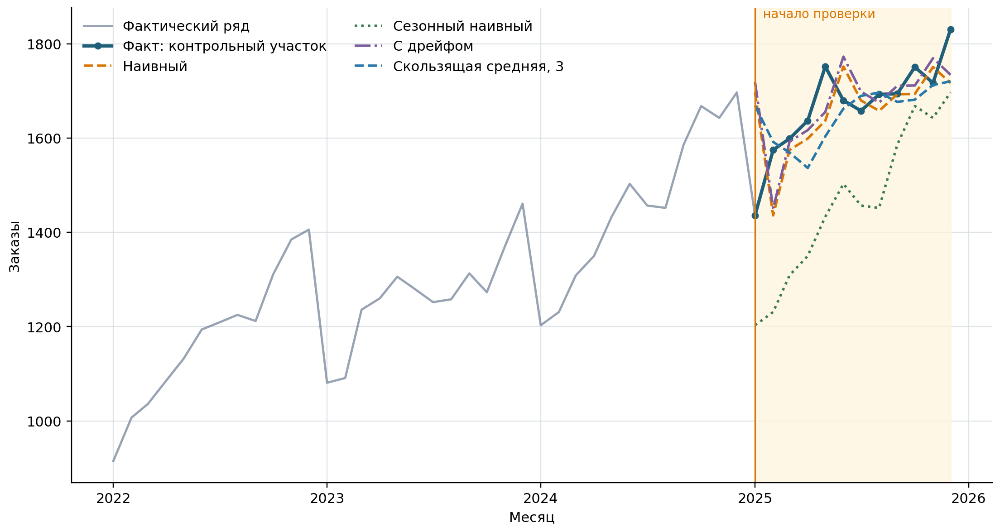

# Сглаживание и проверка прогноза

Сглаживание и прогнозирование используют похожие вычисления, но решают разные
задачи. Сглаживание помогает описать уже наблюдавшийся ряд и выделить его общую
форму. Прогноз оценивает ещё не наступившие значения, поэтому при его построении
нельзя использовать будущие наблюдения [@PodkorytovaSokolov2026_TimeSeries;
@HyndmanAthanasopoulos2021_Forecasting].

## Центрированная скользящая средняя

Для нечётного окна $m=2k+1$ центрированная скользящая средняя в момент $t$
равна

$$
\widetilde T_t=\frac{1}{m}\sum_{j=-k}^{k}y_{t+j}.
$$ {#eq-centered-moving-average}

Например, пятичленная средняя использует два уровня до момента $t$, сам уровень
$y_t$ и два уровня после него. Краткосрочные отклонения частично компенсируются,
а линия становится более гладкой. Однако значения в начале и конце ряда
отсутствуют: для них не хватает наблюдений с одной из сторон.

Центрированная средняя использует будущие относительно момента $t$ уровни,
поэтому она пригодна для ретроспективной оценки тренда, но не является честным
оперативным прогнозом. При чётном сезонном периоде, например 12 месяцев,
сначала рассчитывают двенадцатичленные средние, а затем центрируют их средней из
двух соседних значений — получают среднюю порядка $2\times12$.

```{=latex}
\Needspace{10\baselineskip}
```

## Односторонняя скользящая средняя

В момент $t$ доступны только текущий и предыдущие уровни. Односторонняя
скользящая средняя порядка $m$ вычисляется как

$$
M_t^{(m)}=\frac{1}{m}\sum_{j=0}^{m-1}y_{t-j}.
$$ {#eq-trailing-moving-average}

Значение $M_t^{(m)}$ можно использовать как простой прогноз следующего уровня.
Малое окно быстрее реагирует на изменения, но сохраняет больше шума; большое
окно сильнее сглаживает ряд, но запаздывает при повороте тренда. Размер окна
нельзя выбирать только по красоте линии: его проверяют на будущих относительно
расчёта данных.

## Базовые методы прогноза

Обозначим через $\widehat y_{T+h\mid T}$ прогноз уровня в момент $T+h$,
построенный по данным не позднее момента $T$. Вертикальная черта в индексе
отделяет прогнозируемый момент от последнего доступного наблюдения.

*Наивный прогноз* сохраняет последний известный уровень:

$$
\widehat y_{T+h\mid T}=y_T.
$$ {#eq-naive-forecast}

*Сезонный наивный прогноз* переносит последнее известное значение того же
сезона. Для одношагового прогноза ряда с периодом $m$:

$$
\widehat y_{t\mid t-1}=y_{t-m}.
$$ {#eq-seasonal-naive-forecast}

Для месячных данных при $m=12$ январь прогнозируют по предыдущему январю,
февраль — по предыдущему февралю и так далее.

*Прогноз с дрейфом* продолжает среднее изменение между первым и последним
уровнями обучающего участка:

$$
\widehat y_{T+h\mid T}
=y_T+h\left(\frac{y_T-y_1}{T-1}\right).
$$ {#eq-drift-forecast}

Эти простые методы служат базовыми ориентирами. Более сложная модель имеет
практический смысл, только если она устойчиво прогнозирует лучше подходящего
простого ориентира, а не только точнее описывает прошлые значения.

## Обучающий и контрольный участки

Случайное перемешивание наблюдений временного ряда нарушает хронологию и может
передать модели сведения из будущего. Поэтому первые 36 месяцев учебного ряда —
с января 2022 года по декабрь 2024 года — используем как начальный обучающий
участок, а 12 месяцев 2025 года — как контрольный.

Проверку проводим с движущейся точкой прогноза. Для января 2025 года доступны
только данные по декабрь 2024 года. После наступления января его фактическое
значение разрешается использовать при прогнозе февраля, но февраль и более
поздние месяцы всё ещё остаются неизвестными. Такая схема воспроизводит
ежемесячное обновление прогноза и не допускает утечки будущих данных
[@HyndmanAthanasopoulos2021_Forecasting].

{#fig-forecast-baselines fig-pos="H" fig-alt="Месячные заказы показаны с 2022 по 2025 год; контрольный 2025 год выделен светлым фоном, а поверх его фактических значений проведены линии наивного, сезонного наивного прогноза, прогноза с дрейфом и трёхмесячной скользящей средней"}

Контрольные значения и прогнозы сохранены в
`code/data/monthly-orders-forecast-evaluation.csv`. Каждый прогноз в строке
построен только по предшествующим ей наблюдениям.

## Ошибки и метрики качества

Ошибка прогноза — разность фактического и спрогнозированного уровней:

$$
e_t=y_t-\widehat y_t.
$$ {#eq-forecast-error}

Средняя абсолютная ошибка сохраняет единицы исходного показателя, а корень из
средней квадратичной ошибки сильнее реагирует на крупные отклонения:

$$
\begin{aligned}
\operatorname{MAE} &= \frac{1}{n}\sum_{t=1}^{n}|e_t|,\\
\operatorname{RMSE} &= \sqrt{\frac{1}{n}\sum_{t=1}^{n}e_t^2}.
\end{aligned}
$$ {#eq-forecast-mae-rmse}

Средняя абсолютная процентная ошибка равна

$$
\operatorname{MAPE}=\frac{100\%}{n}
\sum_{t=1}^{n}\left|\frac{e_t}{y_t}\right|.
$$ {#eq-forecast-mape}

MAPE удобна для относительной интерпретации, но не определена при $y_t=0$ и
становится неустойчивой при уровнях, близких к нулю. Поэтому её нельзя считать
универсальной заменой MAE и RMSE.

| Метод | MAE, заказов | RMSE, заказов | MAPE, % |
|:--|--:|--:|--:|
| Наивный | 76,0 | 102,9 | 4,7 |
| Сезонный наивный | 207,6 | 226,0 | 12,6 |
| С дрейфом | 73,9 | 104,1 | 4,6 |
| Скользящая средняя, 3 месяца | 65,2 | 94,1 | 4,0 |

: Ошибки одношаговых прогнозов на контрольном 2025 году {#tbl-forecast-baseline-errors}

В @tbl-forecast-baseline-errors трёхмесячная скользящая средняя показывает
наименьшие MAE и RMSE. Это не универсальное преимущество метода: в учебном ряду
сезонность сочетается с ростом уровня, поэтому перенос прошлогодних значений
систематически занижает прогноз. На другом ряду или горизонте порядок методов
может измениться.

Одного контрольного года недостаточно для окончательного выбора модели.
Надёжнее повторять проверку для нескольких последовательных точек прогноза и
оценивать ошибки именно на том горизонте, который нужен бизнесу. При этом
последний контрольный участок сохраняют нетронутым до завершения выбора метода,
если требуется итоговая независимая оценка.

```{=latex}
\Needspace{12\baselineskip}
```

## Практические ограничения

- Сглаженная линия описывает прошлое, но сама по себе не доказывает наличие
  устойчивого тренда.
- Маленькая ошибка на обучающем участке не гарантирует точного прогноза.
- Сравнивать методы следует на одинаковых датах, горизонтах и единицах.
- Прогноз без базового ориентира трудно оценить: сложность модели не является
  самостоятельным преимуществом.
- После изменения продукта или процесса старые ошибки могут перестать
  характеризовать будущую работу модели.

Далее рассмотрим два способа организации практической работы. Сначала —
авторский сценарий визуального проектирования в Loginom на данных европейских
фондовых индексов, затем — воспроизводимое сравнение базовых прогнозов в
LibreOffice Calc и Python на учебном ряду заказов.
