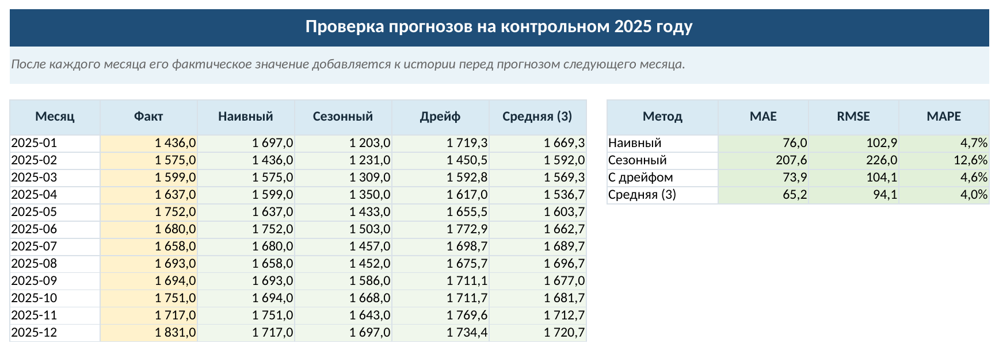
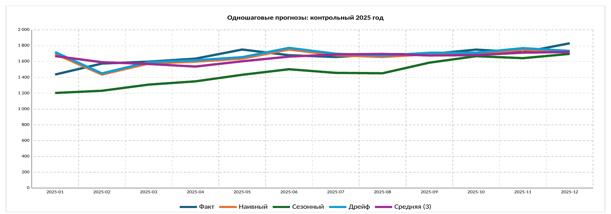

# Анализ временного ряда в LibreOffice Calc и Python

Воспроизведём расчёты предыдущего раздела на одном наборе данных. Исходный ряд
содержит 48 месячных уровней заказов: первые 36 образуют начальный обучающий
участок, а последние 12 используются для последовательной проверки прогноза.
После наступления очередного контрольного месяца его фактический уровень
добавляется к истории и становится доступным для следующего прогноза.

## Рабочая книга LibreOffice Calc

В рабочей книге три листа. На листе «Прогнозы» жёлтым отмечены исходные уровни,
а зелёным — формулы четырёх базовых методов. Лист «Проверка» содержит
контрольный 2025 год, сводные метрики и нативную линейную диаграмму Calc. На
листе «Ошибки» сохранены абсолютные, квадратичные и относительные ошибки,
которые используются для вычисления MAE, RMSE и MAPE. Такое разделение делает
расчёт проверяемым без длинных массивных формул [@LibreOfficeCalcGuide].

```{=latex}
\repolinkblock{book/images/29_time-series-forecast-calc-qr.png}{https://github.com/vshp-online/ps-it-book/blob/main/code/data/monthly-orders-forecast-calc.ods}{code/data/monthly-orders-forecast-calc.ods}
```

```{=html}
<div class="repo-material" role="group" aria-label="Рабочая книга анализа временного ряда в LibreOffice Calc">
  <div class="repo-material-qr"></div>
  <div class="repo-material-path"><a href="https://github.com/vshp-online/ps-it-book/blob/main/code/data/monthly-orders-forecast-calc.ods"><code>code/data/monthly-orders-forecast-calc.ods</code></a></div>
</div>
```

Для января 2025 года используются следующие формулы:

```text
D41: =B40
E41: =B29
F41: =B40+(B40-$B$5)/(ROW()-6)
G41: =AVERAGE(B38:B40)
```

Формула в `D41` сохраняет последний известный уровень, в `E41` берёт значение
того же месяца предыдущего года, в `F41` продолжает среднее изменение от первого
уровня до декабря 2024 года, а в `G41` усредняет три последних наблюдения. После
протягивания формул вниз ссылки сдвигаются вместе с точкой прогноза, поэтому
каждая строка использует только уже наступившие месяцы.

{#fig-time-series-forecast-calc-preview fig-pos="H" fig-alt="Лист Calc с двенадцатью фактическими месячными уровнями 2025 года, прогнозами четырёх методов и таблицей ошибок MAE, RMSE и MAPE"}

На @fig-time-series-forecast-calc-preview фактические значения выделены жёлтым,
а вычисляемые прогнозы и метрики — зелёным. Полученные значения совпадают с
контрольной таблицей предыдущего раздела: на этом учебном ряду наименьшие MAE и
RMSE показывает трёхмесячная скользящая средняя.

```{=latex}
\Needspace{28\baselineskip}
```

{#fig-time-series-forecast-calc-chart fig-pos="H" fig-alt="Линейная диаграмма Calc за 2025 год с фактическими уровнями заказов, наивным, сезонным наивным прогнозом, прогнозом с дрейфом и трёхмесячной скользящей средней"}

Диаграмма на @fig-time-series-forecast-calc-chart связана с теми же ячейками,
что и таблица ошибок. Она помогает увидеть систематическое занижение сезонного
наивного прогноза на растущем ряду, но выбор метода выполняется по численным
ошибкам, а не по внешней близости линий.

## Тот же расчёт в Python

Python читает исходный CSV и повторяет последовательное обновление точки
прогноза. Для вычислений достаточно NumPy; специальная библиотека
прогнозирования здесь не нужна. В цикле сначала строятся четыре прогноза, а
фактический уровень добавляется в историю только после этого.



Результаты совпадают с Calc с точностью округления: для трёхмесячной средней
получаем MAE $65{,}2$, RMSE $94{,}1$ и MAPE $4{,}0\%$. Совпадение двух
реализаций проверяет формулы и порядок обновления данных, но не доказывает, что
выбранный метод сохранит преимущество на следующем периоде.

## Как продолжить проверку

Для нового ряда заменяют исходные уровни, сохраняют хронологию и выбирают
контрольный период под рабочий горизонт. Если он использовался для настройки,
итоговую ошибку оценивают ещё на одном ранее не использовавшемся периоде.

Усложнять модель стоит только после простых ориентиров: улучшение должно
повторяться в нескольких последовательных точках прогноза и оправдывать
дополнительные данные и сопровождение.
