# Моделирование временного ряда методом визуального проектирования

Моделирование временных рядов применяют, когда требуется не только описать
наблюдавшуюся последовательность, но и оценить её возможное продолжение.
Авторегрессионные модели используют зависимость текущего уровня от предыдущих
уровней ряда. Простейшая модель первого порядка AR(1) связывает значение в
момент $t$ с непосредственно предшествующим значением, а модели более высокого
порядка используют несколько лагов.

Крупные организации разрабатывают средства автоматизации массового
прогнозирования. Открытым примером является Prophet — процедура, опубликованная
командой Facebook и реализованная для R и Python; она сочетает настраиваемую
модель с анализом качества прогноза [@TaylorLetham2018_ForecastingAtScale].
Другой подход состоит в визуальном проектировании сценария, когда подготовка
данных, моделирование и вывод результатов задаются связанными блоками.

В этом разделе воспроизведён авторский пример С. З. Умарова на отечественной
аналитической платформе Loginom. Он дополняет основной практикум книги, но не
заменяет обязательные для пособия LibreOffice Calc и Python: Loginom нужен
здесь для демонстрации принципа low-code и визуального устройства аналитического
процесса.

## Структурная модель и low-code

При структурном подходе систему представляют через её элементы и связи между
ними. Уровень детализации выбирают по задаче: модель должна показывать состав
процесса настолько подробно, чтобы можно было определить входные данные,
последовательность преобразований и получаемый результат.

Визуальное проектирование переносит эту идею в интерфейс аналитической
платформы. Пользователь соединяет компоненты импорта, подготовки,
моделирования, визуализации и экспорта в единый сценарий. Такой low-code подход
позволяет быстро получить прототип и сделать порядок обработки видимым для
участников проекта [@TkachenkoTokmurzinKhakki2022_Loginom;
@NevekinProkopenko2020_Loginom; @ProkopenkoTrishin2021_Loginom;
@EvsyukovKapustinIlina2020_Loginom].

Loginom использует понятие *пакета* как контейнера для сценариев и других
компонентов. После создания пакета открывается страница сценария: слева
находится панель доступных компонентов, справа — рабочая область, в которой
строится последовательность обработки [@LoginomARIMAXHelp].

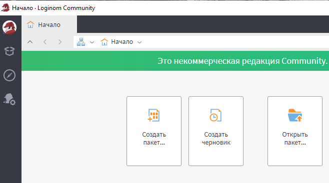{#fig-loginom-create-package fig-pos="H" fig-alt="Стартовая страница Loginom Community с командами создания пакета, создания черновика и открытия пакета" width="90%"}

Для добавления компонента его перетаскивают из панели в рабочую область. На
@fig-loginom-text-file-node показано создание начального узла импорта из
текстового файла.

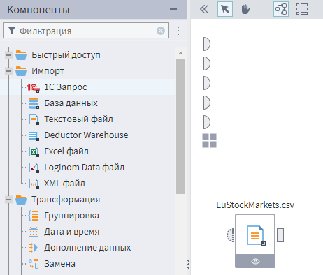{#fig-loginom-text-file-node fig-pos="H" fig-alt="Панель компонентов Loginom и добавленный в рабочую область узел текстового файла EuStockMarkets.csv" width="90%"}

Узел предоставляет команды настройки, выполнения, добавления визуализатора и
других действий. После появления нескольких узлов их порты соединяют мышью;
ненужную связь или узел можно удалить через контекстное меню.

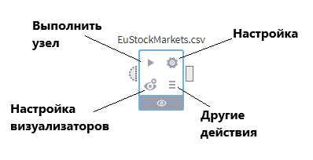{#fig-loginom-node-actions fig-pos="H" fig-alt="Схема узла EuStockMarkets.csv с подписями команд выполнить, настройка, настройка визуализаторов и другие действия" width="70%"}

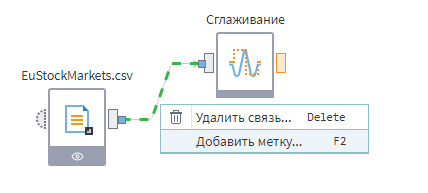{#fig-loginom-connect-nodes fig-pos="H" fig-alt="Узлы EuStockMarkets.csv и сглаживания, соединённые портами; открыто меню удаления связи" width="70%"}

## Сценарий анализа индекса DAX

Авторский сценарий использует набор `EuStockMarkets.csv` из предыдущего
раздела и включает пять операций:

1. импорт исходных данных в Loginom;
2. сглаживание выбранного ряда DAX;
3. построение прогноза компонентом ARIMAX;
4. визуализацию сглаженного ряда и прогноза;
5. экспорт численных результатов в табличный файл.

Для этого создаются четыре основных узла:

1. «Текстовый файл» с исходными данными;
2. «Сглаживание» для столбца DAX;
3. ARIMAX для прогноза `DAX_smoothed` с использованием `rownames`;
4. табличный файл для экспорта результата.

Итоговая схема показана на @fig-loginom-forecast-scenario. Стрелки между
портами явно задают порядок передачи данных.

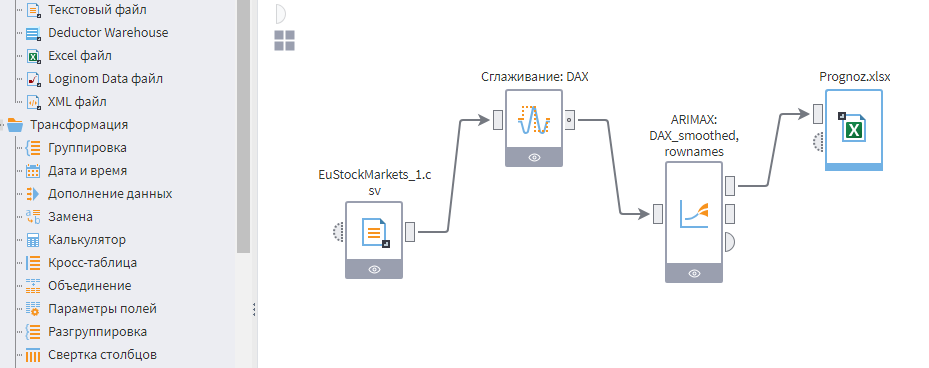{#fig-loginom-forecast-scenario fig-pos="H" fig-alt="Сценарий Loginom из узлов импорта EuStockMarkets, сглаживания DAX, модели ARIMAX и экспорта результата" width="90%"}

## Импорт данных

В настройках узла «Текстовый файл» указывают файл `EuStockMarkets.csv`. После
чтения строки исходного набора появляются в окне предварительного просмотра.
В исходном авторском снимке рабочая копия называется `EuStockMarkets_1.csv`;
содержательно это тот же набор, который в репозитории хранится без суффикса.

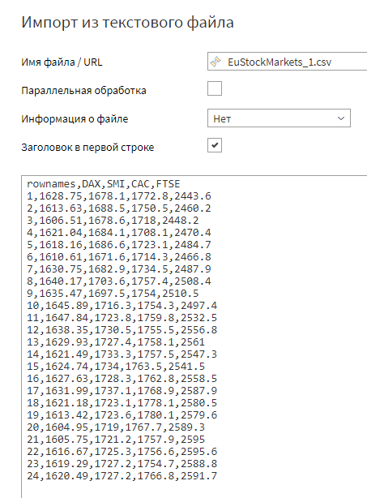{#fig-loginom-import-result fig-pos="H" fig-alt="Окно импорта Loginom с первыми строками EuStockMarkets и столбцами rownames, DAX, SMI, CAC и FTSE" width="90%"}

На следующем шаге Loginom определяет разделитель и типы столбцов. Для сценария
достаточно оставить `rownames` и DAX, хотя другие индексы можно сохранить для
отдельного сравнительного анализа. Автоматически предложенные типы необходимо
проверить: `rownames` является порядковым номером наблюдения, а DAX —
вещественным числовым полем.

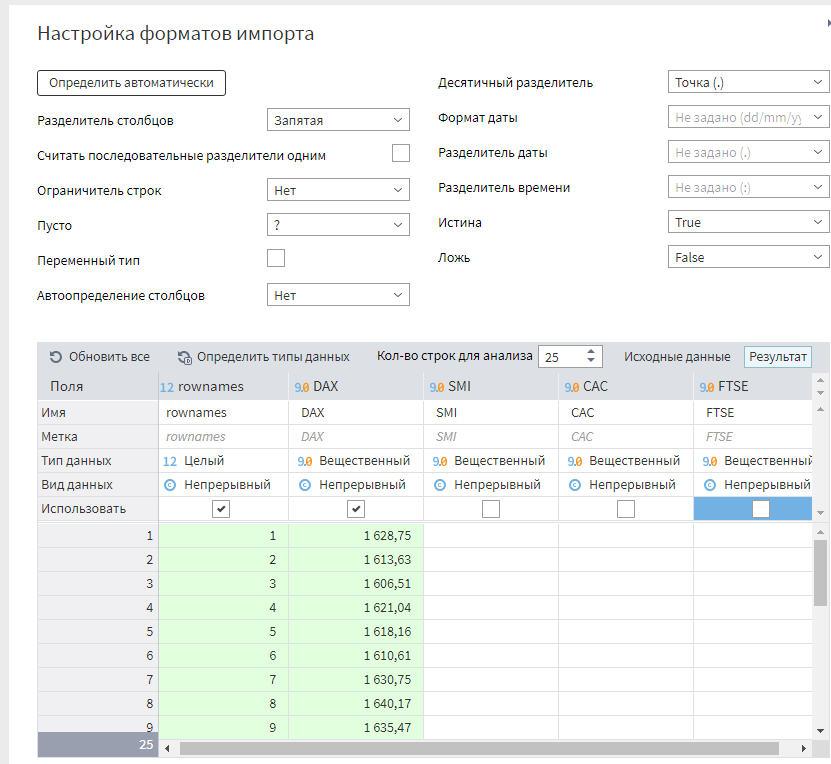{#fig-loginom-import-format fig-pos="H" fig-alt="Мастер форматов импорта Loginom с параметрами CSV и таблицей первых строк EuStockMarkets" width="90%"}

После настройки формата можно уточнить имена и назначение полей, затем выполнить
узел. Пропуск в CSV нельзя автоматически считать нулём: способ обработки должен
соответствовать причине отсутствия значения.

## Сглаживание

Перед моделированием проверяют пропуски, аномалии и структурные изменения.
Авторский сценарий применяет обработчик «Сглаживание» и фильтр
Ходрика--Прескотта с параметром $\lambda=2$. Параметр управляет компромиссом
между близостью тренда к исходному ряду и его гладкостью: при $\lambda=0$
тренд совпадает с исходными данными, а с ростом $\lambda$ становится более
гладким.

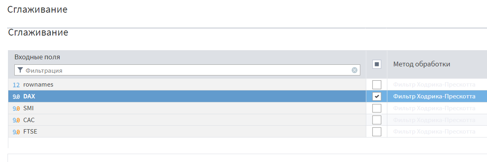{#fig-loginom-smoothing-settings fig-pos="H" fig-alt="Настройки обработчика сглаживания Loginom: для DAX выбран фильтр Ходрика--Прескотта и параметр Lambda 2" width="90%"}

После выполнения узла к его выходному порту добавляют визуализатор. Команда
вызывается непосредственно на узле, затем из списка визуализаторов выбирается
диаграмма.

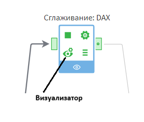{#fig-loginom-visualizer-command fig-pos="H" fig-alt="Узел сглаживания DAX с отмеченной командой настройки визуализаторов" width="70%"}

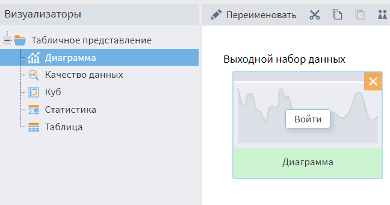{#fig-loginom-add-visualizer fig-pos="H" fig-alt="Окно визуализаторов Loginom, в котором к выходному набору данных добавлена диаграмма" width="90%"}

В область диаграммы переносят поля DAX и `DAX_smoothed` как две серии, а
`rownames` используют как подписи горизонтальной оси. Это позволяет сравнить
исходный и сглаженный ряды на одном графике.

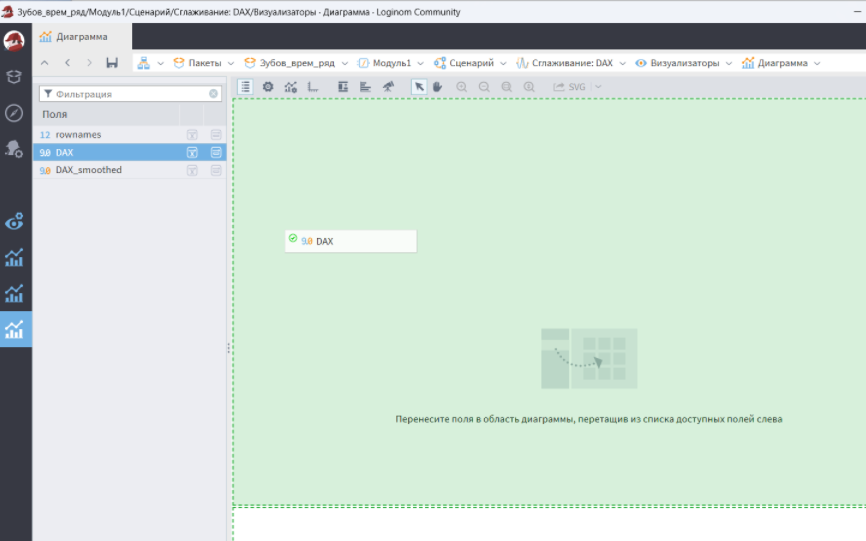{#fig-loginom-diagram-fields fig-pos="H" fig-alt="Рабочая область диаграммы Loginom с полями DAX, DAX_smoothed и rownames" width="90%"}

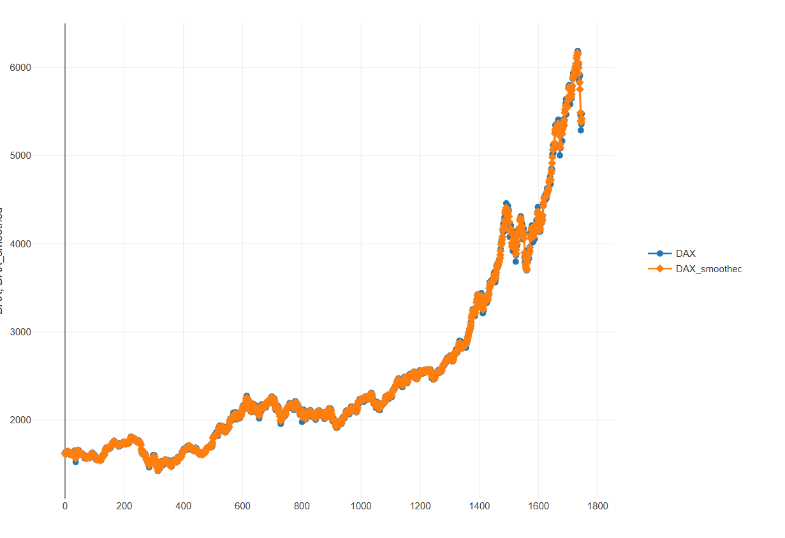{#fig-loginom-dax-smoothing fig-pos="H" fig-alt="Линейная диаграмма DAX и сглаженного DAX на 1860 последовательных наблюдениях" width="90%"}

Сглаживание помогает увидеть общую форму, но не является самостоятельной
оценкой качества прогноза. Если фильтр использует значения по обе стороны
рассматриваемой точки, его нельзя без дополнительной проверки применять при
имитации прогноза в реальном времени.

## Настройка ARIMAX

ARIMAX объединяет авторегрессионную часть, интегрирование, скользящее среднее и
возможность учитывать внешние факторы. Компонент Loginom работает как ARIMA,
если внешние факторы не заданы, и как ARIMAX, если они присутствуют
[@LoginomARIMAXHelp].

На первом шаге каждому входному столбцу назначают роль:

- *прогнозируемое* — ряд, продолжение которого требуется построить;
- *входное* — дополнительный фактор;
- *не задано* — поле, не участвующее в модели.

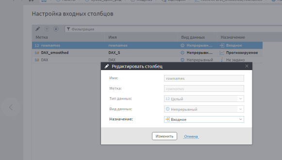{#fig-loginom-input-columns fig-pos="H" fig-alt="Окно Loginom для выбора роли входного поля: входное, прогнозируемое или не задано" width="90%"}

В авторском примере `DAX_smoothed` назначается прогнозируемым полем,
`rownames` — входным, а исходный DAX исключается из модели. Порядковый номер в
этом случае играет роль внешнего временного тренда. Для продолжения прогноза
должны быть известны его будущие значения.

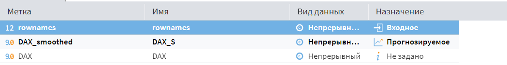{#fig-loginom-model-fields fig-pos="H" fig-alt="Таблица входных полей Loginom: rownames назначено входным, DAX_smoothed прогнозируемым, DAX не используется" width="90%"}

Нормализация для единственного прогнозируемого ряда обычно не требуется. На
следующем шаге задаётся структура модели. В исходном сценарии выбран период
сезонной составляющей 12 и горизонт прогноза 100 наблюдений.

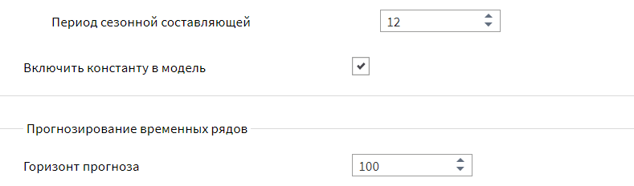{#fig-loginom-model-structure fig-pos="H" fig-alt="Настройки ARIMAX Loginom: период сезонной составляющей 12 и горизонт прогноза 100" width="90%"}

Поскольку `EuStockMarkets` записан в биржевом времени, период 12 здесь означает
12 торговых наблюдений, а не 12 календарных месяцев. Его следует считать
параметром демонстрационного сценария, а не доказанной сезонностью рынка.
Практический выбор периода требует предметного объяснения и сравнения качества
на контрольном участке.

После сохранения настроек узел обучают. К нему добавляют диаграмму с рядами
`DAX_smoothed` и `DAX_smoothed|Прогноз`, а `rownames` задают как подпись
горизонтальной оси.

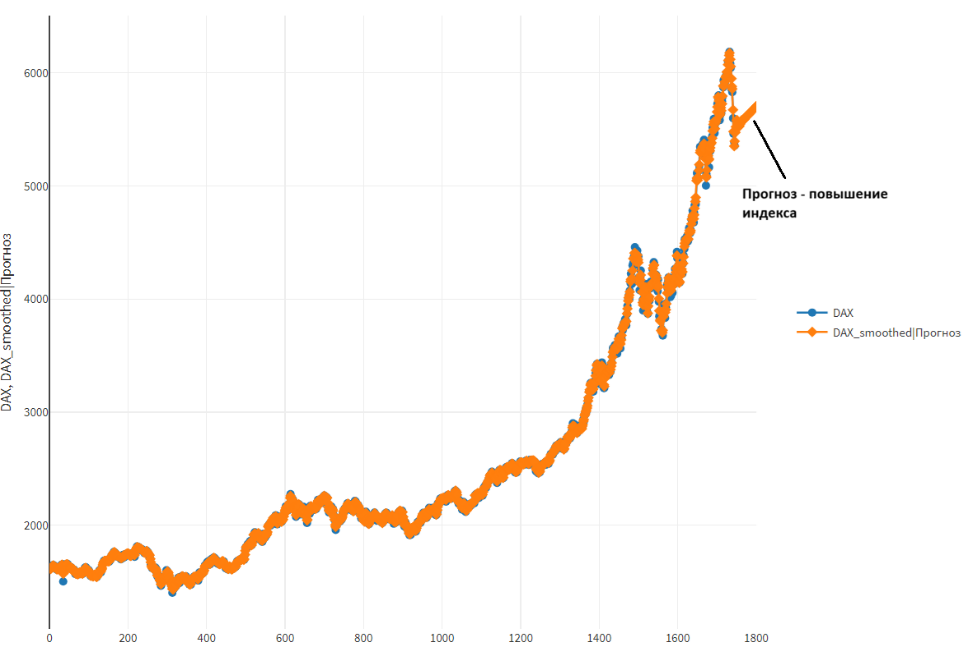{#fig-loginom-forecast-chart fig-pos="H" fig-alt="Диаграмма Loginom со сглаженным рядом DAX и продолжением прогноза на 100 наблюдений" width="90%"}

На графике модель продолжает ряд на 100 наблюдений при заданных параметрах.
Такой результат показывает работу сценария, но по одному изображению нельзя
заключить, что сезонность обнаружена надёжно или что прогноз пригоден для
решения. Для этого нужен контрольный участок и сравнение ошибок с простыми
ориентирами из предыдущего раздела.

## Экспорт и воспроизводимость

Последний узел сохраняет результат в табличный файл. В нём присутствуют
прогноз, нижняя и верхняя границы интервала, если их расчёт включён в настройках
модели. В исходном экспорте эти поля называются `DAX_smoothed|Прогноз`,
`DAX_smoothed|Нижняя граница` и `DAX_smoothed|Верхняя граница`.

| Прогноз | Нижняя граница | Верхняя граница |
|---:|---:|---:|
| 5472,947873 | 5462,271612 | 5483,624135 |
| 5552,902213 | 5494,044703 | 5551,759722 |
| 5559,859167 | 5482,779685 | 5636,93865 |
| 5579,268441 | 5374,702266 | 5783,834615 |
| 5581,865624 | 5039,222263 | 6124,508986 |
| 5572,151315 | 4132,857624 | 7011,445006 |
| 5556,371131 | 1738,870126 | 9373,872135 |
| 5540,602284 | −4584,701176 | 15665,90574 |
| 5529,369309 | −21326,35222 | 32385,09084 |

: Фрагмент экспортированного результата ARIMAX {#tbl-loginom-export-result}

В @tbl-loginom-export-result по мере увеличения горизонта расширяется интервал
прогноза. Чтобы другой аналитик мог повторить расчёт, вместе с результатом сохраняют
версию платформы, исходный CSV, схему сценария, назначения столбцов, параметры
сглаживания и ARIMAX. Отдельно фиксируют, какие наблюдения использовались для
обучения и какие оставались неизвестными при проверке.

Авторский сценарий ценен как подробный пример визуального проектирования. Для
содержательной оценки модели его следует дополнить последовательной проверкой
без утечки будущих данных, метриками ошибок и сравнением с наивным прогнозом.
Такое дополнение не изменяет сценарий, а отделяет демонстрацию технологии от
доказательства прогностического качества.
